# PIPELINE_MAP.md

## Scope

This map reconstructs the **current** pipeline from source code paths, including both:

- legacy production runner path (`ExperimentRunner`)
- unified framework runner path (`UnifiedExperimentRunner`)

## Pipeline A: Legacy Production Path (Current Mainline For Week1/Demo)

### Common entry flows

1. `run_experiment.py` (key=value CLI)
2. `run_experiment_api.py` (argparse one-run wrapper)
3. `scripts/run_framework.py` -> `src/lab/runners/cli.py` (matrix YAML)
4. `scripts/run_week1_stabilization.sh` (orchestrates 3 + checks + plots)
5. `scripts/demo/run_demo_package.sh` (action router over week1 flow)

### Step-by-step data flow

1. **Config resolution / parse**
   - `run_experiment.py` parses `key=value` tokens with `parse_key_value_overrides(...)` in `src/lab/runners/experiment_registry.py`.
   - `ExperimentRegistry.resolve(...)` builds normalized runner config from:
     - `configs/experiment_lab.yaml`
     - model/dataset/attack/defense aliases
     - runtime overrides (`conf`, `imgsz`, `attack.*`, etc.).
   - Matrix path uses direct YAML (for example `configs/modular_experiments.yaml`) via `ExperimentRunner.from_yaml(...)`.

2. **Runner construction**
   - `ExperimentRunner.from_dict(...)` or `.from_yaml(...)` in `src/lab/runners/experiment_runner.py`.
   - Produces:
     - model config
     - dataset paths (`data_yaml`, `image_dir`)
     - runner settings (`confs`, `iou`, `imgsz`, `seed`, `output_root`)
     - experiment list (`ExperimentSpec` records)

3. **Source image selection**
   - Per run, source is either:
     - `image_dir` from config, or
     - `source_override` if provided.

4. **Attack application**
   - `build_attack(...)` from `src/lab/attacks/registry.py`.
   - Attack writes transformed images into:
     - `outputs/_intermediates/<run_name>/attacked/`
   - For gradient attacks, `ExperimentRunner` conditionally injects a fresh YOLO model instance based on `attack.apply` signature.

5. **Defense application**
   - `build_defense(...)` from `src/lab/defenses/registry.py`.
   - Defense writes to:
     - `outputs/_intermediates/<run_name>/defended/`
   - Defended path becomes inference source.

6. **Validation dataset prep (optional)**
   - If `run_validation=true`, runner builds per-run `_val_dataset` under `_intermediates`.
   - Symlinks/copies transformed images and labels.
   - Writes run-specific `data.yaml`.

7. **Inference + validation**
   - `YOLOModel` (`src/lab/models/yolo_model.py`) loads Ultralytics model.
   - `model.validate(...)` optionally runs and writes `<run_dir>/val/metrics.json`.
   - `model.predict(...)` runs with `save=True`, `save_txt=True`, `save_conf=True`, writes run outputs under:
     - `outputs/<run_name>/...`

8. **Metrics aggregation**
   - `append_run_metrics(...)` in `src/lab/eval/metrics.py`:
     - parses label txt files for detection/confidence stats
     - reads validation metrics JSON
     - appends one row to `metrics_summary.csv`
     - updates/creates `experiment_table.md`

9. **Post-run checks and plotting (week1/demo paths)**
   - `scripts/check_metrics_integrity.py`
   - `scripts/check_fgsm_sanity.py`
   - `scripts/plot_results.py`, `scripts/plot_week1_snapshot.py`, `scripts/plot_week1_report_card.py`
   - outputs plot bundle to `<output_root>/plots/`

## Pipeline B: Unified Framework Path (Additive, In Progress)

### Entry flow

- `src/lab/runners/run_experiment.py` with `--config configs/lab_framework_phase5.yaml` and optional `--set key=value` overrides.

### Step-by-step data flow

1. **Config load and merge**
   - `_load_yaml_mapping(...)` + deep override application.
   - Expected sections:
     - `model`, `data`, `attack`, `defense`, `predict`, `validation`, `runner`

2. **Model/plugin resolution**
   - `build_model(...)` from `src/lab/models/registry.py`
   - currently imports and resolves `YOLOModelAdapter`
   - plugin lists available via `--list-plugins`

3. **Image loading**
   - `iter_images(...)` from `src/lab/attacks/utils.py`
   - optional cap via `runner.max_images`

4. **Defense preprocess and attack apply**
   - defense plugin: `build_defense_plugin(...)` (currently none/identity adapter)
   - attack plugin: `build_attack_plugin(...)` (currently blur adapter)
   - order in unified path:
     - defense preprocess -> attack apply -> write prepared image

5. **Inference**
   - `model.predict(...)` on prepared image paths
   - output normalized via adapter schema (`PredictionRecord`)

6. **Defense postprocess**
   - defense plugin `postprocess(...)` on normalized predictions

7. **Structured artifact writes**
   - `predictions.jsonl`
   - `metrics.json` (prediction stats + validation status/metrics)
   - `resolved_config.yaml`
   - `run_summary.json`
   - `prepared_images/`

8. **Validation metrics in framework path**
   - when `validation.enabled=true`, `model.validate(...)` runs.
   - results sanitized by `sanitize_validation_metrics(...)`:
     - non-finite values become `null`
     - explicit status set (`missing`, `partial`, `complete`, `error`)

## File-by-file Responsibility (Core Pipeline Files)

- `src/lab/runners/experiment_registry.py` - key=value override parser + alias-to-runtime config resolver.
- `src/lab/runners/experiment_runner.py` - legacy core orchestration (attack/defense/validate/predict/CSV append).
- `src/lab/models/yolo_model.py` - direct Ultralytics wrapper.
- `src/lab/attacks/registry.py` and `src/lab/defenses/registry.py` - legacy plugin discovery and construction.
- `src/lab/eval/metrics.py` - legacy CSV metrics and table refresh.
- `src/lab/runners/run_experiment.py` - unified framework runner with structured output artifacts.
- `src/lab/models/yolo_adapter.py` - converts legacy model to framework interface + normalized prediction schema.
- `src/lab/eval/framework_metrics.py` - framework-side metric sanitization/summaries.
- `scripts/run_week1_stabilization.sh` - operational workflow glue for preflight + runner + checks + plots.
- `scripts/demo/run_demo_package.sh` - packaged operator UX over week1 workflow.

## Diagram-Style Explanation

```mermaid
flowchart TD
  subgraph legacyFlow [Legacy_Mainline_Flow]
    legacyCli[run_experiment_py_or_run_framework_py] --> registryResolve[ExperimentRegistry_or_matrix_yaml]
    registryResolve --> legacyRunner[ExperimentRunner]
    legacyRunner --> attackBuild[build_attack]
    attackBuild --> defenseBuild[build_defense]
    defenseBuild --> yoloPredict[YOLOModel_predict]
    legacyRunner --> yoloValidate[YOLOModel_validate_optional]
    yoloPredict --> runOutputs[outputs_run_name]
    yoloValidate --> valMetrics[val_metrics_json]
    runOutputs --> csvAppend[append_run_metrics]
    valMetrics --> csvAppend
    csvAppend --> metricsCsv[metrics_summary_csv]
    csvAppend --> tableMd[experiment_table_md]
  end

  subgraph frameworkFlow [Unified_Framework_Flow]
    unifiedCli[src_lab_runners_run_experiment_py] --> unifiedCfg[lab_framework_phase5_yaml_plus_overrides]
    unifiedCfg --> buildModel[build_model_yolo_adapter]
    buildModel --> preprocess[defense_preprocess]
    preprocess --> attackApply[attack_plugin_apply_optional]
    attackApply --> infer[predict_normalized_records]
    infer --> postprocess[defense_postprocess]
    postprocess --> predictionsJsonl[predictions_jsonl]
    infer --> frameworkMetrics[framework_metrics_json]
    unifiedCfg --> resolvedYaml[resolved_config_yaml]
    frameworkMetrics --> runSummary[run_summary_json]
  end
```

## Verified Differences Between The Two Pipelines

- Legacy path writes global `metrics_summary.csv`; framework path writes per-run `metrics.json`.
- Legacy path attack/defense interfaces are directory-to-directory transforms; framework path uses single-image interfaces.
- Unified runner uses explicit metric sanitization for non-finite values; legacy CSV path does not enforce finite-only semantics for all fields.
- Week1/demo operator scripts currently route through legacy runner path, not unified runner path.
