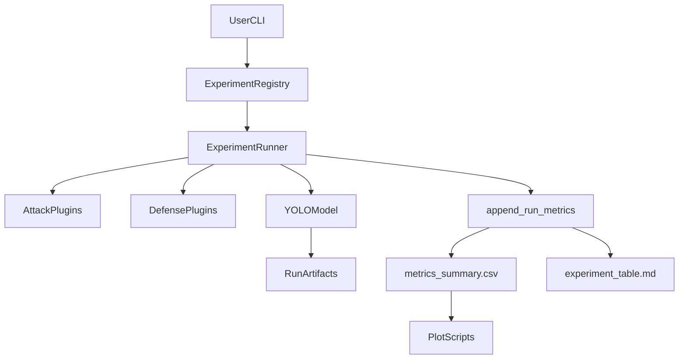

# YOLO-Bad-Triangle Repo Spark Notes

This is the single-file, export-ready handbook for the entire tracked repository.

## How to export this file

- VS Code/Cursor: open this file -> Command Palette -> `Markdown: Open Preview to the Side` -> `Print` -> Save as PDF.
- Pandoc (if installed):
  - `pandoc docs/REPO_SPARK_NOTES.md -o docs/REPO_SPARK_NOTES.pdf`

---

## 1) Project at a glance

The repo is a modular adversarial-ML experiment framework around YOLO. The main loop:

1. Resolve config/CLI into a normalized run spec.
2. Apply an attack transform.
3. Apply an optional defense transform.
4. Run prediction + optional validation.
5. Append metrics to CSV and generate derived tables/plots.

Primary operator entrypoints:

- `run_experiment.py` (key=value CLI, easiest daily interface)
- `run_experiment_api.py` (explicit-flag CLI, integration friendly)
- `scripts/run_framework.py` (YAML matrix runner)
- `scripts/demo/run_demo_package.sh` (packaged demo/rehearsal flow)

---

## 2) Directory map (top-down)

- Repo root: command entrypoints, dependency and ignore policy.
- `src/lab/`: framework engine (attacks/defenses/models/runners/eval).
- `scripts/`: operational automation, integrity checks, plotting, demo packaging.
- `configs/`: dataset/model/runner/experiment matrices.
- `experiments/`: simple YAML presets for explicit API-style runs.
- `docs/`: runbooks, templates, guides, design notes.
- `tests/`: targeted guardrail/parser/FGSM/CLI smoke tests.
- `coco/val2017_subset500/`: tracked subset annotations artifact.

---

## 3) Runtime architecture (mental model)

---

## 4) File-by-file Spark Notes

Each entry uses: **What**, **Why**, **How used**, **Key symbols**, **Risks/gotchas**.

### Root files

#### `.gitignore`
- **What**: ignore policy for caches, local envs, outputs, models, dataset folders.
- **Why**: keep repo source-only; avoid accidental commit of large/generated artifacts.
- **How used**: Git excludes entries like `outputs/`, `*.pt`, `datasets/`, `.venv/`.
- **Key symbols**: include exceptions for `configs/examples` and `scripts/examples`.
- **Risks/gotchas**: generated assets can look "missing" to new users because they are intentionally untracked.

#### `requirements.txt`
- **What**: Python dependency contract.
- **Why**: reproducible runtime for YOLO + plotting + config parsing.
- **How used**: installed via `scripts/setup_env.sh` or manual venv commands.
- **Key symbols**: `ultralytics`, `torch`, `torchvision`, `opencv-python`, `pandas`, `pyyaml`.
- **Risks/gotchas**: GPU/torch wheel compatibility depends on local platform.

#### `run_experiment.py`
- **What**: one-command key=value experiment runner.
- **Why**: fastest operator UX.
- **How used**: parses overrides, resolves aliases through registry, optionally lists components, runs `ExperimentRunner`.
- **Key symbols**: `parse_key_value_overrides`, `ExperimentRegistry.resolve`, discovery flags (`--list-attacks`, etc).
- **Risks/gotchas**: malformed overrides fail fast with usage text.

#### `run_experiment_api.py`
- **What**: explicit-arg CLI for single runs.
- **Why**: easier to call from scripts/tools than key=value freeform.
- **How used**: builds runner config dict directly, supports repeatable `--attack-param/--defense-param`.
- **Key symbols**: `_parse_param_tokens`, `--validate`, `--data-yaml`, `--image-dir`, `--output-root`.
- **Risks/gotchas**: requires explicit execution arguments (`--run_name`, `--attack`, `--conf`, `--imgsz`) unless using list flags.

#### `setup_assets.sh`
- **What**: bootstrap helper to download model weights and COCO val2017 source assets and create subset structure.
- **Why**: standardize local setup.
- **How used**: run once before first experiments.
- **Key symbols**: ultralytics weight warm-up, subset extraction script block, YOLO label conversion call.
- **Risks/gotchas**: depends on network and external COCO hosts.

---

### Data artifact

#### `coco/val2017_subset500/instances_val2017_subset500.json`
- **What**: COCO-style annotations for tracked subset.
- **Why**: canonical annotation artifact used in conversion/validation workflows.
- **How used**: consumed by setup/conversion scripts and as provenance for subset labels.
- **Key symbols**: `images`, `annotations`, `categories` payload expected by COCO tooling.
- **Risks/gotchas**: large JSON; not intended for manual editing.

---

### `configs/`

#### `configs/coco_subset500.yaml`
- **What**: YOLO dataset YAML (path/train/val/names).
- **Why**: validation/evaluation contract for model calls.
- **How used**: referenced by runners as `data_yaml`.
- **Key symbols**: class `names` map for 80 COCO classes.
- **Risks/gotchas**: path mismatch causes validation failure.

#### `configs/experiment_lab.yaml`
- **What**: alias registry config (models/datasets/attacks/defenses + defaults).
- **Why**: decouple user-facing aliases from module names/paths.
- **How used**: loaded by `ExperimentRegistry.from_yaml`.
- **Key symbols**: `defaults`, `models`, `datasets`, `runner`, `attacks`, `defenses`.
- **Risks/gotchas**: alias typo surfaces as unknown component error.

#### `configs/modular_experiments.yaml`
- **What**: multi-experiment matrix example.
- **Why**: run batches through YAML runner.
- **How used**: consumed by `scripts/run_framework.py` and `lab.runners.cli`.
- **Key symbols**: `experiments` list with run templates and params.
- **Risks/gotchas**: run name template collisions overwrite run dirs.

#### `configs/week1_stabilization_demo_matrix.yaml`
- **What**: demo-profile week1 FGSM matrix.
- **Why**: controlled baseline + 3 FGSM epsilons for presentation/rehearsal.
- **How used**: default for `--profile week1-demo`.
- **Key symbols**: `model.path: yolo26n.pt`; attack entries with epsilon `0.0005`, `0.006`, `0.01`.
- **Risks/gotchas**: if epsilons are too strong/weak, narrative shifts.

#### `configs/week1_stabilization_matrix.yaml`
- **What**: stress-profile week1 FGSM matrix.
- **Why**: stronger stress-test variant than demo profile.
- **How used**: default for `--profile week1-stress`.
- **Key symbols**: `model.path: yolo26n.pt`; epsilon `0.004`, `0.008`, `0.016`.
- **Risks/gotchas**: may produce collapse behavior (expected in strict gate context).

---

### `experiments/`

These are compact YAML presets for explicit single-run style.

#### `experiments/baseline.yaml`
- **What**: baseline no-attack preset.
- **Why**: simple reproducible baseline launch.
- **How used**: reference config for API-like flows.
- **Key symbols**: `attack: none`, `defense: none`.
- **Risks/gotchas**: points at `datasets/...` path convention; ensure local dataset structure matches.

#### `experiments/blur_attack.yaml`
- **What**: blur attack preset.
- **Why**: quick perturbation sanity run.
- **How used**: optional config-driven run template.
- **Key symbols**: `attack: blur`.
- **Risks/gotchas**: kernel assumptions come from attack defaults unless overridden.

#### `experiments/deepfool_attack.yaml`
- **What**: deepfool-only preset.
- **Why**: quick advanced-attack baseline.
- **How used**: optional explicit preset.
- **Key symbols**: `attack: deepfool`, `defense: none`.
- **Risks/gotchas**: deepfool params matter significantly for runtime/strength.

#### `experiments/deepfool_defense.yaml`
- **What**: deepfool + median defense preset.
- **Why**: quick attack/defense pair comparison.
- **How used**: integration-friendly one-file test.
- **Key symbols**: `attack: deepfool`, `defense: median`.
- **Risks/gotchas**: alias normalization required (`median` -> `median_blur`).

---

### `src/lab/` package markers

#### `src/lab/__init__.py`
- **What**: package docstring.
- **Why**: marks root package.
- **How used**: import metadata only.
- **Key symbols**: module-level description.
- **Risks/gotchas**: none.

#### `src/lab/runners/__init__.py`
- **What**: lazy export surface for runner/registry classes.
- **Why**: reduce import cost and avoid eager circular import load.
- **How used**: supports `from lab.runners import ExperimentRunner`.
- **Key symbols**: `__getattr__` lazy import switch.
- **Risks/gotchas**: typo in attribute names raises `AttributeError`.

#### `src/lab/models/__init__.py`
- **What**: lazy export of `YOLOModel` + utilities.
- **Why**: keep model import deferred until needed.
- **How used**: package-level convenient imports.
- **Key symbols**: `__getattr__`, exported utility names.
- **Risks/gotchas**: runtime import errors surface only when symbol accessed.

#### `src/lab/eval/__init__.py`
- **What**: export surface for `append_run_metrics` and markdown table generator.
- **Why**: simplify imports.
- **How used**: `from lab.eval import append_run_metrics`.
- **Key symbols**: `__all__`.
- **Risks/gotchas**: none.

#### `src/lab/attacks/__init__.py`
- **What**: attack package public API.
- **Why**: central import path for builders and registrars.
- **How used**: `build_attack`, `register_attack`, etc.
- **Key symbols**: `__all__`.
- **Risks/gotchas**: none.

#### `src/lab/defenses/__init__.py`
- **What**: defense package public API.
- **Why**: mirror attack API ergonomics.
- **How used**: `build_defense`, `register_defense`, etc.
- **Key symbols**: `__all__`.
- **Risks/gotchas**: none.

---

### `src/lab/attacks/`

#### `src/lab/attacks/base.py`
- **What**: attack interface + registry primitives.
- **Why**: plugin architecture for arbitrary attacks.
- **How used**: concrete attacks subclass `Attack` and use `@register_attack`.
- **Key symbols**: `Attack.apply`, `register_attack`, `get_attack_class`, `list_registered_attacks`.
- **Risks/gotchas**: missing decorator means attack is undiscoverable.

#### `src/lab/attacks/utils.py`
- **What**: shared image iterator helper.
- **Why**: prevent duplicated extension-filter loops.
- **How used**: all transform modules iterate files via `iter_images`.
- **Key symbols**: `IMAGE_EXTENSIONS`, `iter_images`.
- **Risks/gotchas**: unsupported extension types are silently skipped.

#### `src/lab/attacks/registry.py`
- **What**: lazy module loader + runtime attack builder.
- **Why**: auto-discover built-ins while keeping startup light.
- **How used**: `build_attack(name, params)` called by runner.
- **Key symbols**: `_load_builtin_attacks`, `build_attack`, `list_available_attacks`.
- **Risks/gotchas**: unsupported names raise explicit `ValueError` with supported list.

#### `src/lab/attacks/none.py`
- **What**: identity/no-op attack.
- **Why**: baseline path compatibility in same pipeline.
- **How used**: `attack=none`.
- **Key symbols**: `NoAttack.apply` returns source dir unchanged.
- **Risks/gotchas**: no output dir materialized by design.

#### `src/lab/attacks/blur.py`
- **What**: Gaussian blur attack.
- **Why**: deterministic, interpretable corruption baseline.
- **How used**: `attack=blur`, optional `kernel_size`.
- **Key symbols**: `GaussianBlurAttack.__post_init__`, `apply`.
- **Risks/gotchas**: kernel must be odd and >=3.

#### `src/lab/attacks/noise.py`
- **What**: Gaussian noise attack.
- **Why**: stochastic corruption benchmark.
- **How used**: `attack=gaussian_noise` (`stddev` tunable).
- **Key symbols**: seed-aware RNG usage, clipping to uint8 range.
- **Risks/gotchas**: high stddev can saturate images and collapse metrics.

#### `src/lab/attacks/deepfool.py`
- **What**: lightweight DeepFool-style iterative perturbation approximation.
- **Why**: stronger iterative perturbation option without full DeepFool dependency complexity.
- **How used**: `attack=deepfool` with `epsilon` and `steps`.
- **Key symbols**: Sobel gradient direction loop, jitter blend.
- **Risks/gotchas**: approximation, not canonical DeepFool; semantics differ from paper implementation.

#### `src/lab/attacks/fgsm.py`
- **What**: FGSM attack implementation supporting tensor mode and pipeline mode.
- **Why**: gradient-based attack centerpiece for robustness experiments.
- **How used**: runner passes model in pipeline mode; tests use tensor mode.
- **Key symbols**: `_resolve_torch_model`, `_compute_loss`, `_apply_to_tensor`, `_tensor_to_uint8_rgb`, `apply`.
- **Risks/gotchas**: requires differentiable outputs and available gradients; model wrappers can break gradient flow.

---

### `src/lab/defenses/`

#### `src/lab/defenses/base.py`
- **What**: defense interface + registry primitives.
- **Why**: symmetric plugin architecture with attacks.
- **How used**: defenses subclass `Defense`, use `@register_defense`.
- **Key symbols**: `Defense.apply`, `register_defense`, `get_defense_class`.
- **Risks/gotchas**: omitted registration makes defense unavailable.

#### `src/lab/defenses/registry.py`
- **What**: lazy defense discovery + builder.
- **Why**: dynamic built-in loading and consistent errors.
- **How used**: runner calls `build_defense`.
- **Key symbols**: `_load_builtin_defenses`, `build_defense`, `list_available_defenses`.
- **Risks/gotchas**: unknown defense names fail fast.

#### `src/lab/defenses/none.py`
- **What**: identity/no-op defense.
- **Why**: keep pipeline shape stable for baseline and attack-only runs.
- **How used**: `defense=none`.
- **Key symbols**: `NoDefense.apply` returns source path unchanged.
- **Risks/gotchas**: no separate defended artifact folder created.

#### `src/lab/defenses/median_blur.py`
- **What**: median blur defense.
- **Why**: common denoising preprocessor baseline.
- **How used**: `defense=median_blur` or alias `median`.
- **Key symbols**: `MedianBlurDefense` with kernel validation.
- **Risks/gotchas**: over-smoothing can degrade clean baseline.

#### `src/lab/defenses/denoise.py`
- **What**: OpenCV NLM color denoising defense.
- **Why**: stronger denoise option than median blur.
- **How used**: `defense=denoise` with tunable hyperparameters.
- **Key symbols**: `cv2.fastNlMeansDenoisingColored` parameters.
- **Risks/gotchas**: can be slower; parameter tuning is dataset-dependent.

---

### `src/lab/models/`

#### `src/lab/models/model_utils.py`
- **What**: model path normalization and label canonicalization helpers.
- **Why**: unify CLI aliases and consistent model labels in outputs.
- **How used**: consumed by runner/registry/model wrapper.
- **Key symbols**: `normalize_model_path`, `model_label_from_path`.
- **Risks/gotchas**: nonstandard filenames map label to stem directly.

#### `src/lab/models/yolo_model.py`
- **What**: thin wrapper around `ultralytics.YOLO`.
- **Why**: isolate framework from direct vendor API details.
- **How used**: runner instantiates and calls `predict`/`validate`.
- **Key symbols**: `YOLOModel.__post_init__`, `predict`, `validate`.
- **Risks/gotchas**: model load errors surface at construction time.

---

### `src/lab/eval/`

#### `src/lab/eval/experiment_table.py`
- **What**: CSV -> markdown table renderer.
- **Why**: human-readable summary for demos/reports.
- **How used**: called directly by script and indirectly by metrics append.
- **Key symbols**: `TABLE_COLUMNS`, `_first_value`, `generate_experiment_table`.
- **Risks/gotchas**: assumes CSV schema has at least core columns.

#### `src/lab/eval/metrics.py`
- **What**: metric parsing, metadata collection, CSV schema management.
- **Why**: central source of run history and integrity metadata.
- **How used**: `append_run_metrics` called per run by `ExperimentRunner`.
- **Key symbols**: `_find_label_files`, `_parse_detection_stats`, `_read_val_metrics`, `append_run_metrics`.
- **Risks/gotchas**: confidence stats intentionally require 6-column prediction label rows.

---

### `src/lab/runners/`

#### `src/lab/runners/cli.py`
- **What**: argparse entrypoint for YAML matrix execution.
- **Why**: single command for config-driven batches.
- **How used**: wrapped by `scripts/run_framework.py`.
- **Key symbols**: `--config`, `--confs`, `--output-root` + backward-compatible `--output_root`.
- **Risks/gotchas**: overriding output root bypasses config default path.

#### `src/lab/runners/experiment_registry.py`
- **What**: key=value override parser + alias resolver + normalized runner-config builder.
- **Why**: separate "what to run" resolution from execution.
- **How used**: primary dependency of `run_experiment.py`; also discovery list source.
- **Key symbols**: `parse_key_value_overrides`, `_merge_dict`, `_assert_safe_run_name`, `ExperimentRegistry.resolve`, `available_*`.
- **Risks/gotchas**: unsafe run names rejected to prevent traversal/path injection.

#### `src/lab/runners/experiment_runner.py`
- **What**: execution engine for experiments.
- **Why**: orchestrates transforms, validation/predict, metadata enrichment, metric writes.
- **How used**: built from YAML or dict then `run()`.
- **Key symbols**: `ExperimentSpec`, path safety checks, `_validation_data_yaml_for_run`, `_prepare_source`, `_config_fingerprint`, `run`.
- **Risks/gotchas**:
  - empty transformed dataset hard-fails run,
  - run/output paths must stay inside `output_root`,
  - validation toggles affect metric completeness.

---

### `scripts/`

#### `scripts/run_framework.py`
- **What**: tiny wrapper to `lab.runners.cli.main`.
- **Why**: stable script entrypoint for YAML runs.
- **How used**: called by orchestration shell scripts.
- **Key symbols**: just import + invoke.
- **Risks/gotchas**: none.

#### `scripts/check_environment.py`
- **What**: preflight checks (python, imports, model weights, dataset path).
- **Why**: fail early before expensive runs.
- **How used**: called in demo scripts and manually.
- **Key symbols**: `CheckResult`, `check_*` family, `main`.
- **Risks/gotchas**: checks availability only, not benchmark quality/performance.

#### `scripts/check_metrics_integrity.py`
- **What**: gate for stale/mixed rows and suspicious flat sweeps.
- **Why**: protect against silently corrupted interpretation.
- **How used**: week1/demo scripts post-run.
- **Key symbols**: required column set, fingerprint collision check, flat-sweep detector.
- **Risks/gotchas**: strictness assumes comparable rows share model/conf/seed grouping.

#### `scripts/check_fgsm_sanity.py`
- **What**: attack trend sanity gate with optional strict all-zero fail.
- **Why**: validate expected trend behavior and isolate per-session checks.
- **How used**: week1/demo gate stage.
- **Key symbols**: `--profile`, `--attack`, `--use-latest-session`, `--fail-on-all-zero-fgsm`.
- **Risks/gotchas**: name still says FGSM but now supports generic attack target argument.

#### `scripts/convert_coco_to_yolo.py`
- **What**: COCO annotation -> YOLO label text converter.
- **Why**: produce YOLO-format labels expected by pipeline.
- **How used**: called during asset setup.
- **Key symbols**: `cat_id_map`, bbox normalization loop.
- **Risks/gotchas**: script appends to label files; reruns without cleanup can duplicate labels.

#### `scripts/generate_experiment_table.py`
- **What**: CLI wrapper to produce markdown table from metrics CSV.
- **Why**: operator-friendly reporting command.
- **How used**: week1 scripts and manual docs flow.
- **Key symbols**: `--input_csv`, `--output_md`.
- **Risks/gotchas**: missing CSV path fails immediately.

#### `scripts/generate_week1_demo_artifacts.sh`
- **What**: deterministic artifact regeneration from existing metrics CSV/output root.
- **Why**: reproducible visuals without rerunning model inference.
- **How used**: fallback demo path and fast package action.
- **Key symbols**: drives `plot_results.py`, `plot_week1_snapshot.py`, `plot_week1_report_card.py`.
- **Risks/gotchas**: expects CSV schema compatible with plotting scripts.

#### `scripts/plot_results.py`
- **What**: primary generic plotting script.
- **Why**: baseline charting for mAP50 and precision/recall by attack.
- **How used**: run directly or through orchestration scripts.
- **Key symbols**: CSV auto-detection, aggregation mode, no-data chart fallback.
- **Risks/gotchas**: defaults still probe `results/metrics_summary.csv` before `outputs/...` for legacy compatibility.

#### `scripts/plot_week1_snapshot.py`
- **What**: week1-focused baseline-vs-FGSM and epsilon trend visual.
- **Why**: concise demo narrative charts.
- **How used**: presentation plot generation.
- **Key symbols**: epsilon extraction from `attack_params_json`, two-plot output.
- **Risks/gotchas**: requires both baseline and FGSM rows with parseable epsilon.

#### `scripts/plot_week1_report_card.py`
- **What**: stylized one-page report card visuals (`worst`, `by-epsilon`, `both`).
- **Why**: slide-ready summary artifacts.
- **How used**: demo artifact generation phase.
- **Key symbols**: `_prepare_data`, `_render_report_card`, `_render_report_card_by_epsilon`.
- **Risks/gotchas**: assumes attack label `fgsm` for targeted report logic.

#### `scripts/run_week1_stabilization.sh`
- **What**: end-to-end week1 matrix orchestrator.
- **Why**: one command for compute + gates + core plotting.
- **How used**: live demo and rehearsal.
- **Key symbols**: `--profile`, `--mode`, `--sanity-attack`, optional presentation plots, `outputs/demo-latest` alias update.
- **Risks/gotchas**: strict mode aborts on sanity failure; demo mode continues with warning.

#### `scripts/setup_dataset.sh`
- **What**: dataset presence checker for expected `datasets/coco/...` layout.
- **Why**: helper for local setup conventions.
- **How used**: optional manual setup validator.
- **Key symbols**: required `images/` + `annotations.json`.
- **Risks/gotchas**: path convention differs from `coco/val2017_subset500` flow used elsewhere.

#### `scripts/setup_env.sh`
- **What**: create `.venv` and install requirements.
- **Why**: quick bootstrap.
- **How used**: first-time setup.
- **Key symbols**: `python -m venv .venv`, `pip install -r requirements.txt`.
- **Risks/gotchas**: prints legacy baseline command wording but core setup remains valid.

#### `scripts/test_framework.sh`
- **What**: smoke script for running a few experiments and checking output CSV presence.
- **Why**: simple shell-level sanity check.
- **How used**: optional manual CI-like quick check.
- **Key symbols**: invokes `run_experiment.py` with baseline/blur/deepfool paths.
- **Risks/gotchas**: can be compute-heavy depending on dataset size.

---

### `scripts/demo/`

#### `scripts/demo/README.md`
- **What**: usage docs for demo package.
- **Why**: single reference for `run_demo_package.sh` actions.
- **How used**: operator guide.
- **Key symbols**: action definitions and default paths.
- **Risks/gotchas**: keep in sync with script flags when orchestration changes.

#### `scripts/demo/run_demo_package.sh`
- **What**: packaged command surface (`preflight`, `live-demo`, `fast`, etc.).
- **Why**: demo operator UX simplification.
- **How used**: main demo/rehearsal script.
- **Key symbols**: profile defaults, output-root resolution fallback, gate and summary actions.
- **Risks/gotchas**: uses `ls|head` for latest dir selection; behavior depends on filesystem timestamps.

#### `scripts/demo/set_demo_reference.sh`
- **What**: symlink alias manager for `outputs/demo-latest` and `outputs/demo-reference`.
- **Why**: stable path for docs/slides/scripts.
- **How used**: run after choosing source output root.
- **Key symbols**: `--source-root`, absolute path normalization, `ln -sfn`.
- **Risks/gotchas**: alias updates are destructive to previous target links by design.

#### `scripts/demo/summary_interpretation.py`
- **What**: compact narrative printer from metrics CSV.
- **Why**: converts raw metrics into presenter-friendly talking points.
- **How used**: `summary` action in demo package.
- **Key symbols**: epsilon parse, baseline-vs-fgsm delta, full-collapse detection.
- **Risks/gotchas**: narrative is attack-label-specific to FGSM rows.

---

### `docs/`

#### `docs/ATTACK_TEMPLATE.md`
- **What**: attack-authoring template.
- **Why**: standardize new module implementation and registration.
- **How used**: copy/modify when adding attacks.
- **Key symbols**: required `apply` signature and decorator usage.
- **Risks/gotchas**: sample command at end is generic and should be tailored per new attack.

#### `docs/DEFENSE_TEMPLATE.md`
- **What**: defense-authoring template.
- **Why**: standardize defense creation and YAML wiring.
- **How used**: copy/modify for new defenses.
- **Key symbols**: `@register_defense`, output path preservation contract.
- **Risks/gotchas**: deterministic/random behavior should be explicit for reviewers.

#### `docs/PIPELINE_IN_PLAIN_ENGLISH.md`
- **What**: plain-language conceptual walkthrough.
- **Why**: onboarding for non-specialist readers.
- **How used**: orientation before code-level docs.
- **Key symbols**: 7-step pipeline and metric interpretation heuristics.
- **Risks/gotchas**: intentionally simplified; does not enumerate every edge case.

#### `docs/TEAM_GUIDE.md`
- **What**: mixed beginner+technical operator/developer guide.
- **Why**: canonical day-to-day manual.
- **How used**: quick start, command reference, extension guidance.
- **Key symbols**: command examples, canonical entrypoint map, gotchas section.
- **Risks/gotchas**: long doc; keep examples synchronized with evolving CLI flags.

#### `docs/WEEK1_DEMO_BASELINE.md`
- **What**: frozen fallback artifact checklist and narrative.
- **Why**: guarantee presentation continuity if live run fails.
- **How used**: fallback runbook companion.
- **Key symbols**: required file checklist in `outputs/demo-reference`.
- **Risks/gotchas**: references historical metric values that may diverge from new runs.

#### `docs/WEEK1_DEMO_REHEARSAL_LOG.md`
- **What**: timestamped rehearsal timing/outcome notes.
- **Why**: set realistic runtime expectations and live guidance.
- **How used**: pre-demo prep.
- **Key symbols**: measured stage windows and presenter guidance.
- **Risks/gotchas**: timing is machine/profile dependent.

#### `docs/WEEK1_DEMO_RUNBOOK.md`
- **What**: canonical live demo procedure.
- **Why**: remove command drift across ad hoc notes.
- **How used**: step-by-step on demo day.
- **Key symbols**: profile-based run commands, checkpoints, fallback path.
- **Risks/gotchas**: assumes assets and environment already prepared.

#### `docs/experiments.md`
- **What**: design artifact and implementation status report.
- **Why**: architectural context and timeline for stakeholders.
- **How used**: progress communication and planning handoff.
- **Key symbols**: requirements tables, architecture diagrams, milestone records.
- **Risks/gotchas**: some status rows may lag behind latest code if not maintained.

---

### `tests/`

#### `tests/test_runner_validation_dataset.py`
- **What**: runner validation dataset + path guardrail tests.
- **Why**: prevent regressions in run safety and validation data preparation.
- **How used**: unit test suite target.
- **Key symbols**: checks label resolution behavior, run-name safety, output-root CSV containment.
- **Risks/gotchas**: synthetic data; does not execute full YOLO inference.

#### `tests/test_metrics_csv_integrity.py`
- **What**: metrics CSV schema and parser integrity tests.
- **Why**: ensure schema evolution is backward-compatible and confidence parsing is safe.
- **How used**: unit test suite target.
- **Key symbols**: schema upgrade preservation test, non-prediction text exclusion, 6-column requirement.
- **Risks/gotchas**: uses temporary filesystem fixtures, not real model outputs.

#### `tests/test_fgsm_smoke.py`
- **What**: FGSM behavior smoke tests + CLI discovery smoke.
- **Why**: protect attack tensor/pipeline correctness and discovery UX.
- **How used**: unit/smoke suite target.
- **Key symbols**: `DummyDetectionModel`, FGSM clamp/shape checks, run_experiment list-attacks subprocess test.
- **Risks/gotchas**: dummy model behavior approximates detector outputs.

---

## 5) Config and script matrix (quick lookup)

- **Config resolution**: `configs/experiment_lab.yaml` + `run_experiment.py` + `src/lab/runners/experiment_registry.py`
- **Batch run execution**: `scripts/run_framework.py` + `src/lab/runners/cli.py` + `configs/modular_experiments.yaml`
- **Week1 orchestration**: `scripts/run_week1_stabilization.sh` + `configs/week1_stabilization_*.yaml`
- **Demo package**: `scripts/demo/run_demo_package.sh` + `scripts/demo/set_demo_reference.sh` + `scripts/demo/summary_interpretation.py`
- **Metrics pipeline**: `src/lab/eval/metrics.py` + `scripts/check_metrics_integrity.py` + `scripts/check_fgsm_sanity.py`
- **Visualization**: `scripts/plot_results.py` + `scripts/plot_week1_snapshot.py` + `scripts/plot_week1_report_card.py`

---

## 6) Artifact/reference inventory (including non-tracked expectations)

Tracked artifacts/reference files:

- `coco/val2017_subset500/instances_val2017_subset500.json`
- all YAML configs under `configs/` and `experiments/`
- docs and runbooks under `docs/`

Expected but intentionally untracked (per `.gitignore`):

- model weights (`*.pt`) like `yolo26n.pt`, `yolo26s.pt`, `yolo11n.pt`, `yolo11s.pt`, `yolov8n.pt`
- generated outputs under `outputs/`
- dataset directories under `coco/` and `datasets/` (except tracked subset annotation JSON)
- local environment `.venv/`

---

## 7) Tests and quality gates

Core protection layers:

- **Unit tests**: `tests/` for runner safety, metrics integrity, FGSM smoke/discovery.
- **Preflight checks**: `scripts/check_environment.py`
- **CSV sanity checks**:
  - `scripts/check_metrics_integrity.py`
  - `scripts/check_fgsm_sanity.py`
- **Workflow-level checks**:
  - `scripts/test_framework.sh`
  - `scripts/demo/run_demo_package.sh fast`

---

## 8) Glossary and acronyms

- **YOLO**: You Only Look Once (object detection model family).
- **FGSM**: Fast Gradient Sign Method attack.
- **NLM**: Non-local means denoising.
- **mAP50**: mean average precision at IoU=0.50.
- **mAP50-95**: mean AP averaged across IoU thresholds 0.50 to 0.95.
- **IoU**: intersection over union.
- **conf**: confidence threshold for prediction filtering.
- **run_name_template**: naming format with confidence token insertion.
- **config_fingerprint**: short hash proving row/config consistency.
- **run_session_id**: run-level grouping token for fresh-session filtering.

---

## 9) Quick-start command index

- Resolve and preview config:
  - `./.venv/bin/python run_experiment.py dry_run=true`
- List framework components:
  - `./.venv/bin/python run_experiment.py --list-attacks`
  - `./.venv/bin/python run_experiment.py --list-defenses`
- Run one explicit API-style experiment:
  - `./.venv/bin/python run_experiment_api.py --run_name demo --attack fgsm --conf 0.25 --imgsz 640`
- Run matrix config:
  - `./.venv/bin/python scripts/run_framework.py --config configs/modular_experiments.yaml`
- Week1 demo profile:
  - `bash scripts/run_week1_stabilization.sh --profile week1-demo --mode demo`
- Rebuild artifacts from existing CSV:
  - `bash scripts/generate_week1_demo_artifacts.sh --output-root outputs/demo-reference`
- Packaged demo fast checks:
  - `bash scripts/demo/run_demo_package.sh fast --profile week1-demo --output-root outputs/demo-reference`

---

## 10) Completeness checklist

This handbook covers every currently tracked file from `git ls-files` at authoring time and maps each to purpose, usage, key logic, and practical risks.
