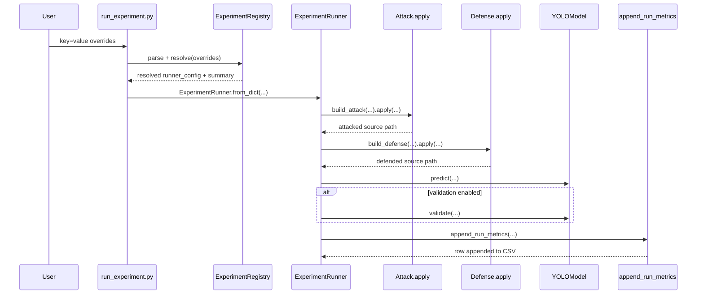

# YOLO Robustness Lab: Current Design Artifacts and Delivery Status

Last updated: 2026-03-15

This document captures the project as implemented in the repository today, including:
- requirements (functional and non-functional),
- system architecture and diagrams,
- major implementation details already delivered,
- updated timeline with completed and remaining work.

## 1) Requirements (current baseline)

### 1.1 Problem statement
Build a repeatable experiment lab to measure how YOLO object detection quality changes under image attacks and optional defenses, while logging comparable metrics across runs.

### 1.2 Functional requirements

| ID | Requirement | Status |
|---|---|---|
| FR-01 | Run a baseline YOLO inference workflow on configured dataset/images. | Implemented |
| FR-02 | Support config-driven attack selection (`none`, `blur`, `gaussian_noise`, `deepfool`). | Implemented |
| FR-03 | Support config-driven defense selection (`none`, `median_blur`, `denoise`). | Implemented |
| FR-04 | Allow one-command execution with CLI key=value overrides. | Implemented |
| FR-05 | Allow modular multi-experiment YAML runs. | Implemented |
| FR-06 | Allow confidence sweeps over multiple thresholds in one command. | Implemented |
| FR-07 | Persist run outputs, labels, and intermediate attacked/defended images. | Implemented |
| FR-08 | Append run-level metrics to CSV and include validation metrics when available. | Implemented |
| FR-09 | Track run metadata (date, git commit, branch, config parameters). | Implemented |
| FR-10 | Generate markdown experiment summary table from metrics CSV. | Implemented |
| FR-11 | Provide environment setup and environment readiness checks. | Implemented |
| FR-12 | Support adding new attacks/defenses via registry extension points. | Implemented |

### 1.3 Non-functional requirements

| ID | Requirement | Status |
|---|---|---|
| NFR-01 | Reproducibility via explicit seed parameter and deterministic config capture. | Partially implemented (seed is propagated; full determinism not guaranteed by all libraries). |
| NFR-02 | Maintainability via modular package structure and clear interfaces. | Implemented |
| NFR-03 | Usability for beginners via one-command runner and team guide. | Implemented |
| NFR-04 | Traceability via CSV history plus git metadata per run. | Implemented |
| NFR-05 | Testability via automated test suite for core modules. | Not implemented yet |

## 2) System architecture

### 2.1 High-level component diagram

```mermaid
flowchart LR
  U[User / CLI] --> A[run_experiment.py<br/>or scripts/run_framework.py]
  A --> B[ExperimentRegistry<br/>parse + resolve]
  B --> C[ExperimentRunner]
  C --> D[Attack Registry + Attack Impl]
  D --> E[Defense Registry + Defense Impl]
  E --> F[YOLOModel (Ultralytics)]
  F --> G[Run Output Folder]
  C --> H[append_run_metrics]
  H --> I[metrics_summary.csv]
  H --> J[experiment_table.md]
  K[configs/*.yaml] --> B
  L[coco subset images] --> D
```

### 2.2 Run sequence diagram



### 2.3 Repository architecture map

- `src/lab/attacks`: attack interfaces, registry, and concrete attack transforms.
- `src/lab/defenses`: defense interfaces, registry, and concrete defense transforms.
- `src/lab/models`: YOLO wrapper + model path/label normalization.
- `src/lab/runners`: config resolution and orchestration of full experiment runs.
- `src/lab/eval`: metric extraction, CSV append, markdown table generation.
- `configs/`: alias/config definitions for models, datasets, and experiment batches.
- root + `scripts/`: one-command CLI plus modular and utility CLIs.

## 3) Implementation details (major functionality delivered)

### 3.1 Run entrypoints and execution modes

- `run_experiment.py`: one-command entrypoint that parses key=value overrides, resolves aliases, supports dry-run, then executes the runner.
- `scripts/run_framework.py`: modular YAML runner for multi-experiment configs.
- `run_experiment_api.py`: explicit-argument wrapper for programmatic integration.
- metrics collection is integrated in `append_run_metrics(...)` during runner execution; no separate collector script is required.

### 3.2 Config and resolution

- `ExperimentRegistry` resolves:
  - model alias to `.pt` model path and normalized model label,
  - dataset alias to `data_yaml` and source image directory,
  - attack/defense alias + merged parameter overrides,
  - confidence list (`conf` or `confs`) and runner overrides.
- Friendly aliases are currently handled (`gaussian -> gaussian_noise`, `median -> median_blur`).

### 3.3 Attack/defense plugin architecture

- Attack and defense abstractions use interface + decorator-based registration.
- Built-ins are lazy-loaded from package modules and instantiated through `build_attack` / `build_defense`.
- Delivered attacks: no-op, gaussian blur, gaussian noise, deepfool-style perturbation.
- Delivered defenses: no-op, median blur, NLM denoise.

### 3.4 Orchestration and artifacts

For each `(experiment, conf)` pair, `ExperimentRunner`:
1. renders a deterministic run name tokenized by confidence,
2. prepares intermediates in `_intermediates/<run_name>/attacked` and `.../defended`,
3. runs YOLO prediction (and optional validation),
4. appends one metrics row into the configured CSV.

### 3.5 Metrics and reporting

- `append_run_metrics` writes:
  - run metadata: date, commit, branch, run name, model/attack/defense, conf/iou/imgsz/seed,
  - detection stats parsed from generated YOLO label files,
  - validation metrics from `metrics.json` when available.
- Markdown summary table generation is available through evaluator utility + script.

### 3.6 Environment support

- `scripts/setup_env.sh` creates `.venv` and installs dependencies.
- `scripts/check_environment.py` validates Python, required imports, dataset path, and model weight availability.

## 4) Updated timeline

### 4.1 Accomplished engineering milestones

| Date | Milestone | Evidence |
|---|---|---|
| 2026-02-26 | Repository hygiene and dependency foundation established. | early setup commits |
| 2026-02-28 | Baseline + blur attack workflow landed. | checkpoint commit history |
| 2026-03-01 | YOLO API runner, metrics collector, and mAP pipeline added. | merge + feature commits |
| 2026-03-10 | Modular experiment framework refactor completed. | framework refactor commit |
| 2026-03-10 | One-command config-driven experiment lab delivered. | one-command lab commit |
| 2026-03-10 | Multi-model selection support (`yolo8`, `yolo11*`) added. | model selection commit |
| 2026-03-10 | Env setup/check scripts added. | setup + check commits |
| 2026-03-10 | Auto markdown experiment table generation added. | table generation commit |
| 2026-03-10 | CLI UX improvements for run summary and usage completed. | latest CLI UX commit |

### 4.2 Accomplished execution milestones (actual runs recorded)

Week1 stabilization matrix completed under:

- `outputs/demo-reference/` (friendly alias for canonical week1 demo root)
- `metrics_summary.csv` rows: 4
- `experiment_table.md` generated
- plots generated in `outputs/demo-reference/plots/`

Recorded rows from that fresh run session:

| Run name | Attack | Conf | Precision | Recall | mAP50 | mAP50-95 |
|---|---|---|---:|---:|---:|---:|
| `baseline-control-demo-confidence025` | none | 0.25 | 0.6245 | 0.5017 | 0.5988 | 0.4688 |
| `attack-primary-level-0005-demo-confidence025` | fgsm (`epsilon=0.0005`) | 0.25 | 0.0000 | 0.0000 | 0.0000 | 0.0000 |
| `attack-primary-level-0060-demo-confidence025` | fgsm (`epsilon=0.006`) | 0.25 | 0.0000 | 0.0000 | 0.0000 | 0.0000 |
| `attack-primary-level-0100-demo-confidence025` | fgsm (`epsilon=0.01`) | 0.25 | 0.0000 | 0.0000 | 0.0000 | 0.0000 |

### 4.3 Tasks remaining

#### Highest priority
1. Add defense-enabled FGSM runs (for example median blur and denoise) in the same week1 matrix.
2. Add confidence-threshold sweep (`conf=0.25,0.5`) for robustness curves, still using fresh timestamped output roots.
3. Document benchmark epsilon choice for current model/config based on this run set.

#### Medium priority
4. Add automated tests for:
   - override parsing and alias resolution,
   - attack/defense registry loading and error handling,
   - metric parsing and table generation paths.
5. Add a formal experiment plan file capturing exact matrix, expected outputs, and acceptance criteria.

#### Nice to have
6. Add optional richer reporting (plots/charts from metrics CSV).
7. Add per-run config snapshot export next to run outputs for auditability.

## 5) Current readiness summary

- Framework architecture and core implementation are in place and usable now.
- Per-run validation now uses transformed images (`_intermediates/.../attacked`) with original labels for trustworthy attack evaluation.
- Week1 baseline + FGSM matrix has been executed from a fresh output root with generated table and plots.
- Next focus should be defense comparison breadth and confidence-threshold sweeps.
