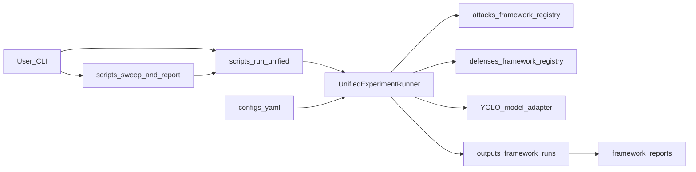
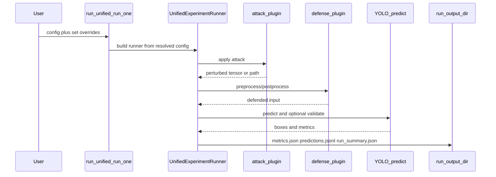

# YOLO Robustness Lab: Design Artifacts and Delivery Status

Last updated: 2026-03-21

Operational status: **framework-only.** Canonical execution is `scripts/run_unified.py` and `scripts/sweep_and_report.py`. Legacy root shims and `scripts/run_framework.py` are removed from the tree; do not follow older docs that reference them.

This document summarizes:

- requirements (functional and non-functional),
- system architecture,
- how runs and sweeps are implemented today,
- a **historical** milestone timeline (paths and commands in older rows may predate the current layout).

## 1) Requirements (current baseline)

### 1.1 Problem statement

Build a repeatable experiment lab to measure how YOLO object detection quality changes under image attacks and optional defenses, with comparable metrics across runs.

### 1.2 Functional requirements

| ID | Requirement | Status |
|---|---|---|
| FR-01 | Run baseline YOLO inference on a configured dataset/images. | Implemented |
| FR-02 | Config-driven attack selection via plugin registry (`fgsm`, `pgd`, `deepfool`, blur variants, etc.). | Implemented |
| FR-03 | Config-driven defense selection via plugin registry (`median_preprocess`, `c_dog`, `c_dog_ensemble`, etc.). | Implemented |
| FR-04 | CLI overrides via `run_unified.py` `--set key=value` (dotted paths). | Implemented |
| FR-05 | Multi-cell attack/defense sweeps via `sweep_and_report.py`. | Implemented |
| FR-06 | Confidence and runner limits configurable in YAML / `--set`. | Implemented |
| FR-07 | Persist per-run outputs: metrics, predictions, run summary (contract JSON). | Implemented |
| FR-08 | Optional mAP50 validation after each run (`validation.enabled` / sweep `--validation-enabled`). | Implemented |
| FR-09 | Run metadata captured in `run_summary.json` (model, attack, defense, config snapshot). | Implemented |
| FR-10 | Markdown + CSV sweep reports (`framework_run_report.md`, `framework_run_summary.csv`, team summary). | Implemented |
| FR-11 | Environment setup and `scripts/check_environment.py` readiness checks. | Implemented |
| FR-12 | New attacks/defenses via registry decorators in `*_adapter.py` / registry modules. | Implemented |

### 1.3 Non-functional requirements

| ID | Requirement | Status |
|---|---|---|
| NFR-01 | Reproducibility via explicit seed and captured config (full determinism not guaranteed by all libs). | Partially implemented |
| NFR-02 | Maintainability via modular `src/lab/` package and clear contracts. | Implemented |
| NFR-03 | Usability via README, team guide, and single-command sweep. | Implemented |
| NFR-04 | Traceability via per-run JSON artifacts and git metadata where recorded. | Implemented |
| NFR-05 | Testability via automated tests under `tests/` (unittest). | Implemented |

## 2) System architecture

### 2.1 High-level component diagram

### 2.2 Run sequence (single experiment)

### 2.3 Repository map (current)

| Area | Location |
|---|---|
| Single run CLI | `scripts/run_unified.py` |
| Sweep CLI | `scripts/sweep_and_report.py` |
| Core runner | `src/lab/runners/run_experiment.py` |
| Config / registry resolution | `src/lab/runners/experiment_registry.py` |
| Attack plugins | `src/lab/attacks/` |
| Defense plugins | `src/lab/defenses/` |
| Model adapter | `src/lab/models/` |
| Derived metrics | `src/lab/eval/derived_metrics.py` |
| Sweep reporting | `src/lab/reporting/framework_comparison.py` |
| Schemas / contracts | `schemas/v1/`, `src/lab/config/contracts.py` |
| Artifact validation | `scripts/ci/validate_outputs.py`, `src/lab/health_checks/` |

## 3) Implementation details (current)

### 3.1 Entrypoints

- **`scripts/run_unified.py run-one`**: one experiment from `configs/default.yaml` (or `--config`) with `--set` overrides.
- **`scripts/sweep_and_report.py`**: Cartesian product of attacks × defenses (and presets such as smoke/full), optional parallel workers, optional validation, consolidated reports under `outputs/framework_reports/<sweep_id>/`.

### 3.2 Config and resolution

`ExperimentRegistry` resolves model alias, dataset YAML, attack/defense names, and merges parameter overrides from YAML and CLI.

### 3.3 Plugins

Attacks and defenses register through the framework registries; implementations live alongside adapters. See `README.md` for the current plugin names.

### 3.4 Per-run artifacts

Each run directory under `outputs/framework_runs/<run_name>/` includes:

- `metrics.json` — mAP50 (when validation ran), detection counts, average confidence, etc.
- `predictions.jsonl` — per-image prediction records.
- `run_summary.json` — metadata and config snapshot for the run.

### 3.5 Reporting and derived metrics

Sweep aggregation and markdown/CSV tables are produced by `src/lab/reporting/framework_comparison.py`. Interpretable summaries use `attack_effectiveness` and `defense_recovery` from `src/lab/eval/derived_metrics.py` (see tests in `tests/test_framework_reporting.py`).

### 3.6 Environment

- Create a venv and `pip install -r requirements.txt` (see root `README.md`).
- Run `PYTHONPATH=src ./.venv/bin/python scripts/check_environment.py` to verify imports, dataset path, and weights.

## 4) Historical timeline (may reference removed paths)

The table below records engineering milestones as originally documented. Commands like `scripts/run_framework.py` or root `run_experiment.py` **no longer exist** in this repository; use `scripts/run_unified.py` / `scripts/sweep_and_report.py` instead.

| Date | Milestone | Notes |
|---|---|---|
| 2026-02-26 | Repository hygiene and dependencies | Early setup |
| 2026-02-28 | Baseline + blur attack workflow | Checkpoint history |
| 2026-03-01 | Metrics and mAP pipeline | Evolved into framework JSON outputs |
| 2026-03-10 | Modular framework refactor | Unified runner and registries |
| 2026-03-15+ | Legacy removal and sweep reporting | CSV-only pipeline removed; framework reports added |

Older experiment matrices may have lived under paths such as `outputs/demo-reference/`; that layout is **not** required for current runs. New work should target `outputs/framework_runs/` and `outputs/framework_reports/`.

### 4.1 Example historical results (illustrative)

The following table is preserved as an **example** of a past FGSM matrix (numeric results depend on model and dataset); it is not regenerated by the current CLI.

| Run name | Attack | Conf | Precision | Recall | mAP50 | mAP50-95 |
|---|---|---|---:|---:|---:|---:|
| `baseline-control-demo-confidence025` | none | 0.25 | 0.6245 | 0.5017 | 0.5988 | 0.4688 |
| `attack-primary-level-0005-demo-confidence025` | fgsm (`epsilon=0.0005`) | 0.25 | 0.0000 | 0.0000 | 0.0000 | 0.0000 |
| `attack-primary-level-0060-demo-confidence025` | fgsm (`epsilon=0.006`) | 0.25 | 0.0000 | 0.0000 | 0.0000 | 0.0000 |
| `attack-primary-level-0100-demo-confidence025` | fgsm (`epsilon=0.01`) | 0.25 | 0.0000 | 0.0000 | 0.0000 | 0.0000 |

## 5) Current readiness summary

- Framework runner, plugin registries, and contract outputs are the supported path.
- Sweeps can run with parallel workers; on a single GPU, prefer `--workers 1` to avoid contention (see `README.md`).
- Next research steps are open-ended (broader defense matrices, epsilon benchmarks, Colab GPU workflows); use the README and `CLAUDE.md` for commands.
