# YOLO-Bad-Triangle Mastery Handbook

This handbook is a beginner-friendly guided tour of the YOLO-Bad-Triangle repo. Its job is not just to tell you what commands exist. Its job is to help you understand what the system is trying to do, how the pieces fit together, what each major process produces, where the weak spots are, and how to explain all of that out loud like someone who actually learned it.

Use this document in two ways:

1. Read it front to back once so you get the whole mental model.
2. Use the later sections as a defense sheet before you talk to your professors.

## 1. Big-Picture Orientation

### What this repo is for in plain English

This repo studies how well an object detector survives bad inputs.

The detector starts with clean images.

Then the repo can:

- attack the images
- try to repair or filter the attacked images
- run the detector
- measure how much performance was lost
- compare which attacks are strongest and which defenses help most
- optionally train a learned defense and test whether the new checkpoint is actually better

If you want a one-line summary:

> This repo is an experiment lab for attacking object detection, measuring the damage, testing defenses, and reporting the results in a reproducible way.

### Real-world comparison

Imagine airport baggage scanners.

- The clean image is the normal scanner image.
- The attack is someone deliberately adding noise, blur, stickers, or carefully chosen patterns so the scanner misses important objects.
- The defense is a cleanup or repair step before the scanner image reaches the final detection system.
- The detector is the scanner's recognition model.
- The report is the evidence showing how much the sabotage worked and whether the cleanup step helped.

### The repo map by purpose

This repo is easier to understand by job than by folder name.

| Area | Main location | What it does |
| --- | --- | --- |
| Runtime entrypoints | `scripts/` | Commands humans run |
| Core execution engine | `src/lab/runners/` | Expands config, runs attacks, defenses, prediction, metrics, artifacts |
| Config and profiles | `configs/`, `src/lab/config/` | Defines default settings and named experiment surfaces |
| Plugins | `src/lab/plugins/`, `src/lab/core/` | Makes models, attacks, and defenses selectable by name |
| Attacks | `src/lab/attacks/`, `src/lab/plugins/core/attacks/`, `src/lab/plugins/extra/attacks/` | Ways to damage the image |
| Defenses | `src/lab/defenses/`, `src/lab/plugins/core/defenses/`, `src/lab/plugins/extra/defenses/` | Ways to clean or correct the image/predictions |
| Models | `src/lab/models/`, `src/lab/plugins/core/models/`, `src/lab/plugins/extra/models/` | Detector adapters |
| Evaluation | `src/lab/eval/` | Prediction normalization, metrics, schemas |
| Reporting | `src/lab/reporting/`, `scripts/reporting/` | CSV, Markdown, dashboard, summaries |
| Automation | `scripts/automation/` | Closed-loop attack/defense ranking and tuning |
| Training | `scripts/training/`, `src/lab/defenses/training/` | Data export, local learned-defense training, checkpoint gating |
| Health checks and CI | `scripts/check_environment.py`, `scripts/ci/`, `src/lab/health_checks/` | Validates machine, outputs, and repo standards |
| Tests | `tests/` | Behavior, compatibility, contract, and regression checks |
| Outputs | `outputs/` | Run artifacts, reports, cycle state, summaries, checkpoints |

### How to read this repo without getting lost

Study it in this order:

1. `scripts/run_unified.py`
2. `src/lab/runners/run_experiment.py`
3. `src/lab/runners/run_intent.py`
4. `configs/pipeline_profiles.yaml`
5. `src/lab/config/profiles.py`
6. `src/lab/core/plugin_registry.py`
7. `src/lab/core/adapter_loader.py`
8. one attack adapter, one defense adapter, and one model adapter
9. `src/lab/eval/framework_metrics.py`
10. `src/lab/reporting/framework_comparison.py`
11. `scripts/automation/auto_cycle.py`
12. `scripts/training/train_from_signal.py`

That order works because it moves from "how you start the system" to "how one run works" to "how many runs get compared" to "how the repo tries to improve itself."

### What this really means

You do not need to memorize every function.

You do need to know:

- what enters the system
- what order things happen in
- what leaves the system
- which files prove what happened
- which scripts are the public surface
- which parts are stable and which parts are experimental

## 2. Foundations Before Code

This section defines the words you need before reading the code.

### Essential concepts in human language

- `YOLO (You Only Look Once)`: a family of object detectors that look at an image and predict boxes, classes, and confidence scores in one main prediction pass. In this repo, YOLO is the main model family.
- `Object detection`: finding where objects are and what they are. Unlike image classification, it does not just say "there is a dog." It says "there is a dog here, with this bounding box."
- `Inference`: the act of running a trained model on an input image to get predictions.
- `Validation`: measuring model quality against labeled data. In this repo, validation is where metrics like `mAP50` come from.
- `Adversarial attack`: a deliberate input change designed to make the model worse. Think "image sabotage."
- `Defense`: a method that tries to reduce attack damage. Think "cleanup filter" or "repair step."
- `Confidence`: how sure the model says it is about a prediction.
- `Baseline`: the normal clean run with no attack and no defense. This is the comparison anchor.
- `Checkpoint`: a saved model weight file. A checkpoint is like a frozen snapshot of what the model learned at a certain moment.
- `Plugin`: a selectable module registered under a name like `fgsm` or `median_preprocess`. Plugins let the repo swap components without rewriting the core runner.
- `Schema`: a required shape for JSON outputs. A schema is like a form with strict required fields.
- `Artifact`: a file written by a run, like `metrics.json` or `predictions.jsonl`.
- `Sweep`: a batch of many runs across attacks, defenses, or both.
- `Profile`: a named experiment surface that decides what model, attacks, defenses, and rules are considered canonical.
- `Resume`: skipping work that is already complete if the repo can prove the old run exactly matches the new intent.
- `Provenance`: metadata proving where a result came from, including config fingerprints, checkpoint fingerprints, and reporting context.
- `mAP50 (mean Average Precision at 50 percent Intersection over Union)`: the main object detection quality metric used in this repo's profile system. Higher is better.
- `IoU (Intersection over Union)`: how much a predicted box overlaps the ground-truth box. `mAP50` uses an IoU threshold of 0.50.
- `COCO (Common Objects in Context)`: the dataset style this repo expects for validation labels and class naming.

### Attack names and acronyms you will hear

- `FGSM (Fast Gradient Sign Method)`: one-step gradient attack.
- `PGD (Projected Gradient Descent)`: multi-step gradient attack.
- `DeepFool`: iterative attack that tries to cross a decision boundary with a small change.
- `EOT-PGD (Expectation Over Transformation PGD)`: PGD that optimizes through multiple transformed versions of the image, making the attack more robust.
- `CW (Carlini-Wagner)`: a stronger optimization-based attack family.
- `Square`: a black-box style attack that does not rely on the same gradient path as FGSM or PGD.
- `JPEG attack`: attack by intentionally degrading image quality with compression artifacts.
- `Blur`: attack by smearing the image so the detector loses useful edges and texture.

### Defense and systems terms you will hear

- `DPC-UNet`: the learned preprocessing defense family used in this repo for `c_dog` and `c_dog_ensemble`. The code treats `DPC-UNet` as the model name; it does not spell out the acronym expansion, so do not invent one when defending the project.
- `U-Net`: a U-shaped convolutional network architecture often used for image-to-image tasks like denoising or restoration.
- `c_dog`: the main learned DPC-UNet-based preprocessing defense plugin.
- `c_dog_ensemble`: a variant that mixes median filtering with DPC-UNet passes.
- `Blind patch recovery`: tries to detect suspicious patch regions without being told exactly where the patch is.
- `Oracle patch recovery`: uses patch metadata to inpaint the exact known patch region. This is an upper-bound experiment, not a realistic blind defense.
- `CI`: in this repo, this can mean two different things depending on context.
- `Continuous integration`: automated quality checks run like a robot reviewer.
- `Confidence interval`: a statistical uncertainty range, used by `generate_auto_summary.py`.
- `MPS (Metal Performance Shaders)`: Apple's acceleration backend for local PyTorch work on Mac hardware.

### Mental shortcuts that make the repo much easier

- Attack = "make the image worse on purpose."
- Defense preprocess = "clean the image before the detector sees it."
- Defense postprocess = "edit the detector's output after prediction."
- Plugin registry = "menu of interchangeable parts."
- Profile = "official competition rulebook for a certain experiment surface."
- Artifact contract = "the set of files a finished run must leave behind."

### What this really means

If a professor says "Explain FGSM, PGD, `mAP50`, provenance, and why profiles matter," they are basically asking whether you understand:

- what changes the input
- what measures the damage
- what proves a run is real
- what keeps experiments comparable

## 3. The Public Surface of the Repo

Think of these scripts as the human-facing control panel.

### The commands that matter most

```bash
PYTHONPATH=src ./.venv/bin/python scripts/check_environment.py

PYTHONPATH=src ./.venv/bin/python scripts/run_unified.py run-one --profile yolo11n_lab_v1

PYTHONPATH=src ./.venv/bin/python scripts/run_unified.py sweep --profile yolo11n_lab_v1 --preset smoke

PYTHONPATH=src ./.venv/bin/python scripts/run_unified.py patch-matrix --matrix-config configs/patch_artifacts.yaml

PYTHONPATH=src ./.venv/bin/python scripts/demo/run_demo.py

PYTHONPATH=src ./.venv/bin/python scripts/automation/auto_cycle.py --profile yolo11n_lab_v1
```

### What each top-level entrypoint does

- `scripts/run_unified.py`: the main public entrypoint. It exposes `run-one`, `sweep`, and `patch-matrix`.
- `src/lab/runners/run_experiment.py`: the real single-run engine behind `run-one`.
- `scripts/sweep_and_report.py`: the sweep backend that `run_unified.py sweep` forwards to.
- `scripts/demo/run_demo.py`: a guided end-to-end demo with preflight, sweep, artifact validation, report checks, and no-op detection.
- `scripts/automation/auto_cycle.py`: the closed-loop system that ranks attacks, ranks defenses, tunes parameters, validates winners, and writes cycle state.
- `scripts/training/`: the real learned-defense training pipeline.
- `scripts/reporting/`: the real report generation pipeline.

### Why there are duplicate script names

You will notice pairs like:

- `scripts/train_from_signal.py`
- `scripts/training/train_from_signal.py`

That is intentional.

The top-level file is a compatibility wrapper. The namespaced file under `scripts/training/` is the real implementation. The repo keeps old public entrypoints alive while moving code into cleaner subpackages.

That is a useful thing to mention out loud because it proves you noticed the difference between "backward-compatible CLI path" and "actual implementation location."

### Quick map of command families

| Family | Main script | Use it when |
| --- | --- | --- |
| Single run | `scripts/run_unified.py run-one` | You want one baseline, attack, or defended run |
| Batch experiments | `scripts/run_unified.py sweep` | You want baseline plus multiple attacks and defenses plus reports |
| Imported patch benchmarking | `scripts/run_unified.py patch-matrix` | You want to evaluate saved patch artifacts across placements and defenses |
| Demo | `scripts/demo/run_demo.py` | You want one guided end-to-end sanity path |
| Closed-loop tuning | `scripts/automation/auto_cycle.py` | You want ranking, tuning, validation, and cycle state |
| Reporting | `scripts/reporting/*.py` | You already have runs and need summaries or dashboards |
| Training | `scripts/training/*.py` | You want to export data, train a learned defense, or gate checkpoints |
| Health checks | `scripts/check_environment.py`, `scripts/ci/*.py` | You want to validate machine setup, outputs, or repo quality |

## 4. One Complete Run, Step by Step

This is the most important section in the whole handbook.

If you can explain one full run clearly, you understand the heart of the repo.

### The runtime flow

```mermaid
flowchart LR
    A["Config or profile"] --> B["Overrides applied"]
    B --> C["Model, attack, defense plugins resolved"]
    C --> D["Images collected"]
    D --> E["attack.apply"]
    E --> F["defense.preprocess"]
    F --> G["model.predict"]
    G --> H["defense.postprocess"]
    H --> I["Prediction metrics summarized"]
    I --> J["Optional validation on attacked images"]
    J --> K["Artifacts written: JSONL, JSON, YAML"]
```



### Why the order matters

The repo's current semantic order is:

1. `attack.apply`
2. `defense.preprocess`
3. `model.predict`
4. `defense.postprocess`

That order means the defense is trying to recover from an already-corrupted input. The repo is not measuring "can a defense prevent the attack from ever touching the image?" It is measuring "once the image has been attacked, can the defense still rescue useful signal before the detector predicts?"

### Step 1: Choose a config or a profile

You can start from:

- a plain YAML config like `configs/default.yaml`
- a named profile like `yolo11n_lab_v1`

A plain config is just settings.

A profile is settings plus policy. It tells the repo which attacks and defenses are canonical, which are manual-only, which model is expected, and what the authoritative metric is.

### Step 2: Apply `--set` overrides

Overrides let you change dotted paths at runtime without editing YAML files.

Example:

```bash
PYTHONPATH=src ./.venv/bin/python scripts/run_unified.py run-one \
  --profile yolo11n_lab_v1 \
  --set attack.name=fgsm \
  --set defense.name=median_preprocess \
  --set runner.run_name=defended_fgsm_median_preprocess
```

That command takes the profile defaults and changes only the chosen fields.

### Step 3: Resolve plugin availability

The runner checks whether extra plugins should be included.

Important rule:

- If you are using a profile and staying purely canonical, the repo can hide extra plugins.
- If you choose manual-only or incompatible components, extra plugins are allowed so the repo can still build them.

This is subtle but important. The profile system is not just a menu. It is a guardrail.

### Step 4: Load the model

The runner builds the model plugin by name, such as `yolo`, then calls `load()`.

For YOLO:

- it resolves the weights path
- creates an Ultralytics YOLO object
- stores a model label for reporting

### Step 5: Collect images

The runner reads the image directory from `config.data.source_dir`.

If `runner.max_images` is greater than zero, it truncates the list. That is how smoke runs stay small and fast.

### Step 6: Apply the attack

For each image:

- the runner reads the image with OpenCV
- if an attack exists, it calls `attack.apply(image, model=model, seed=seed+index)`
- the attack may return metadata such as patch position, objective information, or per-image hints

This metadata matters later, especially for patch-aware defenses like `oracle_patch_recover`.

### Step 7: Run defense preprocessing

The attacked image is passed to `defense.preprocess(...)`.

This is where things like:

- median filtering
- JPEG recompression
- bit depth reduction
- DPC-UNet cleanup
- patch inpainting

happen before the detector sees the image.

The processed images are written into `run_dir/images/`.

### Step 8: Predict with the model

The model gets the prepared image paths and returns normalized prediction records.

These records contain fields like:

- `image_id`
- `boxes`
- `scores`
- `class_ids`
- `metadata`

### Step 9: Run defense postprocessing

Some defenses might want to edit predictions after the detector runs.

In this repo, many defenses use identity postprocessing, but the interface exists so the defense surface is complete.

### Step 10: Summarize predictions

The repo turns raw predictions into easier summary numbers:

- image count
- total detections
- images with detections
- images without detections
- mean confidence
- median confidence
- per-class counts and mean confidence

These are fast diagnostic metrics.

### Step 11: Optional validation

If `validation.enabled=true`, the repo creates a temporary dataset YAML that points validation at the attacked prepared images while still reusing the original labels.

That is how the repo can compute `mAP50` on perturbed images instead of only on clean originals.

### Step 12: Write artifacts

The runner writes:

- `predictions.jsonl`
- `resolved_config.yaml`
- `run_summary.json`
- `metrics.json`

Important detail:

`metrics.json` is written last and acts like the completion sentinel. The repo treats its presence as the sign that the run finished cleanly.

### Step 13: Record provenance

The run records:

- config fingerprint
- attack signature
- defense signature
- model checkpoint fingerprint
- defense checkpoint fingerprints
- seed
- profile name
- authoritative metric
- profile compatibility
- reporting context

This is how resume logic can later decide whether an old run is really the same as a new intended run.

### Baseline example

Command:

```bash
PYTHONPATH=src ./.venv/bin/python scripts/run_unified.py run-one \
  --profile yolo11n_lab_v1 \
  --set runner.run_name=baseline_none
```

What happens:

- attack is `none`
- defense is `none`
- the detector sees clean images
- the output becomes the comparison anchor for later attack and defense runs

### Attack-only example

Command:

```bash
PYTHONPATH=src ./.venv/bin/python scripts/run_unified.py run-one \
  --profile yolo11n_lab_v1 \
  --set attack.name=fgsm \
  --set runner.run_name=attack_fgsm
```

What changes:

- each image is perturbed with FGSM
- no defense tries to repair it
- the metrics show raw attack damage relative to baseline

### Defended example

Command:

```bash
PYTHONPATH=src ./.venv/bin/python scripts/run_unified.py run-one \
  --profile yolo11n_lab_v1 \
  --set attack.name=fgsm \
  --set defense.name=median_preprocess \
  --set runner.run_name=defended_fgsm_median_preprocess
```

What changes:

- FGSM attacks the image first
- median filtering tries to remove some attack noise
- the detector runs on the defended image
- now you can compare:
  - baseline vs attack-only = damage
  - attack-only vs defended = recovery

### The four main artifacts you must know cold

#### `predictions.jsonl`

One JSON record per image.

Use this when you care about image-level detail.

Think: "the raw per-image evidence."

#### `metrics.json`

High-level prediction metrics plus validation metrics, runtime timing, and pipeline order metadata.

Use this when you care about numerical results.

Think: "the scoreboard."

#### `run_summary.json`

Run metadata, model/attack/defense settings, signatures, provenance, runtime environment, and references to metrics.

Use this when you care about reproducibility and auditability.

Think: "the receipt."

#### `resolved_config.yaml`

The actual final config after profile expansion and overrides.

Use this when you need to prove exactly what settings were used.

Think: "the exact recipe."

### What this really means

If someone asks "What does one run do?", the shortest strong answer is:

> A run starts from a config or profile, applies optional overrides, loads a model plus attack and defense plugins, prepares images in the order attack then defense preprocess, predicts, optionally validates, and writes structured artifacts that capture both results and provenance.

## 5. Guided Tour of Every Major Process

This section walks through the major executable flows in the repo.

### 5.1 `run-one`

**What it is for:** One experiment run.

**When you would use it:** You want one baseline, one attack-only run, or one defended run.

**Command shape:**

```bash
PYTHONPATH=src ./.venv/bin/python scripts/run_unified.py run-one \
  --profile yolo11n_lab_v1 \
  --set attack.name=pgd \
  --set defense.name=median_preprocess
```

**Inputs:**

- config or profile
- optional `--set` overrides
- optional seed

**Internal steps:**

1. resolve config
2. apply overrides
3. resolve plugins
4. load model
5. collect images
6. attack image
7. defense preprocess
8. predict
9. defense postprocess
10. summarize metrics
11. optional validation
12. write artifacts

**Outputs:** One run directory with images and JSON/YAML artifacts.

**Common failure points:**

- bad source image path
- missing model weights
- unsupported plugin name
- missing DPC-UNet checkpoint when using `c_dog`
- validation dataset path missing

**Professor-friendly explanation:** "`run-one` is the atomic unit of the repo. Every higher-level process is just a smarter way of launching many `run-one`-style experiments and comparing them."

### 5.2 `sweep`

**What it is for:** Baseline plus many attack and defense runs, followed by reports.

**When you would use it:** You want a structured benchmark instead of one isolated run.

**Public command:**

```bash
PYTHONPATH=src ./.venv/bin/python scripts/run_unified.py sweep \
  --profile yolo11n_lab_v1 \
  --preset smoke \
  --attacks fgsm,pgd,deepfool \
  --defenses median_preprocess,jpeg_preprocess
```

**Backend:** `scripts/run_unified.py sweep` forwards to `scripts/sweep_and_report.py`.

**Important phases:**

1. baseline
2. attack-only runs
3. defended runs
4. reports

**Useful flags:**

- `--preset smoke` for fast sanity runs
- `--preset full` for full image count
- `--resume` to skip already-complete exact matches
- `--workers` for parallel subprocesses
- `--validation-enabled` to request validation metrics
- reporting context flags like `--reporting-authority`

**Outputs:**

- run directories under a runs root
- aggregate report artifacts under a report root

**Common failure points:**

- forgetting that `all` plugin expansion behaves differently under profiles
- using manual-only plugins without understanding profile compatibility
- stale partial outputs when not using resume correctly
- slow attacks taking much longer than expected

**Professor-friendly explanation:** "A sweep is a reproducible benchmark batch. It runs the clean baseline, then attacks, then attack-plus-defense combinations, then computes aggregate reports that compare damage and recovery."

### 5.3 `patch-matrix`

**What it is for:** Benchmarking imported adversarial patch artifacts across placement modes and defenses.

**When you would use it:** You already have a saved patch artifact and want to test it systematically instead of regenerating it.

**Command shape:**

```bash
PYTHONPATH=src ./.venv/bin/python scripts/run_unified.py patch-matrix \
  --matrix-config configs/patch_artifacts.yaml
```

**What the matrix file contains:**

- profile
- shared overrides
- artifact entries
- placement modes
- defense list
- per-defense parameters

**How it works internally:**

1. load matrix YAML
2. read artifact definitions
3. cross product artifacts x placement modes x defenses
4. convert each combination into a `run-one` command
5. execute the commands one by one

**Typical run name format:**

- `patchmatrix__artifact__placement__defense`

**Outputs:** Many run directories, one for each patch/placement/defense combination.

**Common failure points:**

- missing environment variable for `artifact_path`
- missing `DPC_UNET_CHECKPOINT_PATH` when `c_dog` is included
- confusing imported patch evaluation with gradient attack sweeps

**Professor-friendly explanation:** "Patch matrix mode is for fixed patch artifacts. Instead of generating perturbations from scratch like FGSM or PGD, it loads a prebuilt patch and tests how placement and defense choice change the result."

### 5.4 Demo flow

**What it is for:** A guided end-to-end robustness demo.

**When you would use it:** You want a single command that performs the most important checks and leaves behind a clean demo bundle.

**Command shape:**

```bash
PYTHONPATH=src ./.venv/bin/python scripts/demo/run_demo.py
```

**Internal stages:**

1. preflight
2. sweep
3. per-run artifact validation
4. core report existence check
5. auto-summary generation
6. no-op detection
7. manifest writing

**Outputs:** A timestamped demo folder under `outputs/demo/<timestamp>/`.

**What makes it different from a plain sweep:**

- it performs a stricter preflight
- it validates output contracts and schemas
- it checks that attack and defense behavior was not effectively a no-op
- it writes a demo manifest

**Common failure points:**

- environment check fails before any runs start
- requested `c_dog` defense without `DPC_UNET_CHECKPOINT_PATH`
- missing required report outputs
- no-op attack or defense detected

**Professor-friendly explanation:** "The demo is an end-to-end showcase path. It is less about deep tuning and more about proving the whole pipeline works cleanly from environment check through final artifacts."

### 5.5 Report generation

**What it is for:** Turning run directories into human-readable summaries.

**When you would use it:** You already have framework run artifacts and want comparison outputs instead of raw per-run files.

**Main scripts:**

- `scripts/reporting/generate_framework_report.py`
- `scripts/reporting/generate_team_summary.py`
- `scripts/reporting/generate_dashboard.py`
- `scripts/reporting/generate_failure_gallery.py`
- `scripts/reporting/generate_auto_summary.py`
- `scripts/reporting/generate_cycle_report.py`
- `scripts/reporting/print_summary.py`

**How to think about them:**

- `generate_framework_report.py`: the main aggregate comparison layer
- `generate_team_summary.py`: short team-facing summary in JSON and Markdown
- `generate_dashboard.py`: static HTML dashboard
- `generate_failure_gallery.py`: visual failure examples
- `generate_auto_summary.py`: numerical summary with bootstrap confidence intervals
- `generate_cycle_report.py`: history over multiple cycles
- `print_summary.py`: fast local diagnostic

**Typical inputs:**

- a runs root or report root
- framework run directories containing `metrics.json` and `run_summary.json`
- sometimes a previously generated summary CSV

**Typical outputs:**

- `framework_run_summary.csv`
- `framework_run_report.md`
- `team_summary.json`
- `team_summary.md`
- `dashboard.html`
- `failure_gallery.html`
- cycle history CSV/Markdown outputs

**Common failure points:**

- report root does not contain expected summary CSV
- missing baseline row
- mixed reporting context makes comparison weaker
- users confuse local diagnostic summaries with authoritative ranking outputs

**Professor-friendly explanation:** "Reporting scripts do not create predictions. They read structured run artifacts, infer baseline/attack/defense relationships, compute damage and recovery summaries, and package the results for humans."

### 5.6 Environment check

**What it is for:** Validating the local machine before you waste time on experiments.

**Command shape:**

```bash
PYTHONPATH=src ./.venv/bin/python scripts/check_environment.py
```

**What it checks:**

- Python version
- pinned package versions
- torch runtime health
- dataset presence
- label pairing
- YOLO weight availability
- optional DPC-UNet checkpoint availability

**What it does not prove:** It does not prove the repo is logically bug-free. It only proves the local setup looks compatible.

**Common failure points:**

- package versions do not match expected pins
- dataset path missing
- model weights missing
- DPC-UNet checkpoint missing when `--require-cdog` is used

**Professor-friendly explanation:** "The environment check is a machine-readiness gate, not an experiment-validity proof."

### 5.7 Quality gate and repo audits

**What they are for:** Preventing the repo from drifting into an unhealthy state.

**Main scripts:**

- `scripts/ci/run_repo_quality_gate.py`
- `scripts/ci/run_repo_standards_audit.py`
- `scripts/ci/validate_outputs.py`
- `scripts/ci/check_tracked_outputs.py`

**How they differ:**

- `run_repo_quality_gate.py`: lint, type check, tests, CI demo run, output validation, report generation, tracked output policy
- `run_repo_standards_audit.py`: compatibility-focused tests and optional fast quality gate
- `validate_outputs.py`: enforce artifact contracts and schemas
- `check_tracked_outputs.py`: enforce policy about what output files are allowed in the repo

**Important detail:** the CI lane of `run_repo_quality_gate.py` even creates a tiny synthetic image so the demo path can run.

**Inputs:**

- source code under `src/`, `tests/`, and `scripts/`
- repo-level config like `configs/ci_demo.yaml`
- output schemas and tracked-output policy

**Outputs:**

- exit codes
- terminal diagnostics
- in the CI lane, temporary run and report artifacts used for validation

**Common failure points:**

- lint issues
- mypy issues
- pytest failures
- schema failures
- output tracking policy failures

**Professor-friendly explanation:** "These scripts are the repo's self-discipline layer. They test code quality, compatibility wrappers, and output contracts."

### 5.8 `auto_cycle`

**What it is for:** Automated ranking, tuning, validation, and iterative improvement.

**Command shape:**

```bash
PYTHONPATH=src ./.venv/bin/python scripts/automation/auto_cycle.py \
  --profile yolo11n_lab_v1
```

**The four phases:**

1. `Characterize`: run attacks without defenses and rank the strongest attacks
2. `Matrix`: run top attacks against all defenses and rank the most promising defenses
3. `Tune`: do adaptive coordinate descent over attack and defense parameters
4. `Validate`: re-run best candidates on larger validation workloads and report `mAP50`

**Files you should know:**

- `outputs/cycle_state.json`
- `outputs/.cycle.lock`
- `outputs/cycle_history/`
- `logs/auto_cycle.log`

**Important ideas inside the cycle:**

- resumable state
- lock file to prevent concurrent cycles
- warm starts across cycles
- pinned defenses like `c_dog`
- slower attacks get lower image caps in some phases
- ranking uses smoke-scale diagnostics before authoritative validation

**Why Phase 3 exists:** The repo does not assume default parameters are best. It actively searches nearby parameter settings.

**Common failure points:**

- trying to run while the lock file is held
- underestimating runtime of slow attacks
- assuming smoke ranking is identical to full validation ranking
- forgetting that the profile constrains what the canonical catalog is

**Professor-friendly explanation:** "Auto-cycle is the repo's tournament plus tuning loop. It first asks which attacks hurt most, then which defenses recover most, then tunes parameters, then validates the winners at more serious scale."

### 5.9 `export_training_data.py`

**What it is for:** Packaging clean and attacked image pairs for learned-defense training.

**Command shape:**

```bash
PYTHONPATH=src ./.venv/bin/python scripts/training/export_training_data.py --from-signal
```

**What it exports into the zip:**

- clean images
- attacked images grouped by attack name
- a starting checkpoint

**How it chooses attacked images:**

- it prefers `validate_atk_<name>/images/` when available
- otherwise it falls back to `attack_<name>/images/`

**Why that matters:** validation directories tend to represent the more serious evaluation run, not just the earlier smoke-scale run.

**Common failure points:**

- no usable attack directories found
- missing clean images
- missing checkpoint file
- signal file points at a cycle whose runs do not exist anymore

**Professor-friendly explanation:** "This script converts experiment outputs into a supervised image-to-image training package for the learned defense."

### 5.10 `train_dpc_unet_local.py`

**What it is for:** Local fine-tuning of the learned preprocessing defense.

**Command shape:**

```bash
PYTHONPATH=src ./.venv/bin/python scripts/training/train_dpc_unet_local.py \
  --preset signal_driven \
  --training-zip outputs/training_exports/some_cycle_training_data.zip
```

**What it can control:**

- preset
- training zip
- output checkpoint
- resume checkpoint
- epochs
- batch size
- learning rate
- patch size
- edge loss weight
- timestep range
- perturbation erasing
- feature loss weight
- detector-aligned loss

**Why this script matters:** it is the actual local model-training step for the DPC-UNet defense.

**Common failure points:**

- training zip missing
- resume path confusion
- unrealistic expectation of speed on CPU or MPS
- enabling expensive feature loss without budgeting extra runtime

**Professor-friendly explanation:** "This is local learned-defense training. It fine-tunes the DPC-UNet checkpoint using exported clean and attacked image pairs."

### 5.11 `train_from_signal.py`

**What it is for:** One orchestrated signal-driven training and gating path.

**Command shape:**

```bash
PYTHONPATH=src ./.venv/bin/python scripts/training/train_from_signal.py \
  --signal-path outputs/cycle_training_signal.json
```

**Internal steps:**

1. load the cycle training signal
2. resolve baseline checkpoint A
3. decide output paths for candidate checkpoint and manifest
4. export training data
5. train a candidate checkpoint
6. run a clean A/B gate
7. run an attacked A/B gate
8. write `training_manifest.json`
9. print manual promotion commands if both gates pass

**Why there are two gates:**

- clean gate checks that the new defense did not hurt clean performance too much
- attack gate checks that the new defense still helps on the relevant attack

**Important policy detail:** passing does not automatically promote the checkpoint. Promotion is manual.

**Common failure points:**

- missing baseline checkpoint
- incompatible profile for learned-defense training
- export failure
- candidate checkpoint not written
- clean gate or attack gate failure

**Professor-friendly explanation:** "Train-from-signal is the repo's disciplined learned-defense candidate pipeline. It does not just train. It trains, compares against the current checkpoint, and refuses automatic promotion."

### 5.12 `evaluate_checkpoint.py`

**What it is for:** A/B compare checkpoint A and checkpoint B.

**Command shape:**

```bash
PYTHONPATH=src ./.venv/bin/python scripts/training/evaluate_checkpoint.py \
  --checkpoint-a dpc_unet_final_golden.pt \
  --checkpoint-b outputs/checkpoints/candidate.pt \
  --attack blur \
  --defense c_dog \
  --images 50
```

**How it works internally:**

1. create a temporary runs root
2. launch one validation run with checkpoint A
3. launch one validation run with checkpoint B
4. extract `mAP50` and detection counts
5. compute `delta_mAP50`
6. emit a JSON verdict

**Important detail:** the script injects `DPC_UNET_CHECKPOINT_PATH` into the subprocess environment so the defense uses the chosen checkpoint.

**Common failure points:**

- checkpoint path missing
- no validation metrics extracted
- assuming equal detection counts means equal quality

**Professor-friendly explanation:** "This script is a controlled head-to-head checkpoint comparison. It answers whether the candidate learned defense is actually better than the current one under the selected conditions."

### 5.13 `run_training_ritual.py`

**What it is for:** End-to-end signal-driven ritual after a completed cycle.

**Intended steps:**

1. check that `outputs/cycle_training_signal.json` exists and is fresh
2. export training data
3. call `train_from_signal.py`
4. print the final verdict from `training_manifest.json`

**Why it exists:** It packages the training path into one ritualized command so the workflow is harder to do sloppily.

**Important warning:** there is currently a real CLI bug in this script's export step. See the "Honest limitations" section.

**Professor-friendly explanation:** "The training ritual is the operator-facing wrapper for the signal-driven training path, but the current implementation has a CLI bug in the export handoff."

### 5.14 Useful supporting utilities

These are not the center of the repo, but knowing them makes you sound fluent instead of shallow.

- `scripts/automation/watch_cycle.py`: live terminal watcher for the current cycle state
- `scripts/automation/cleanup_stale_runs.py`: delete old framework runs that predate checkpoint promotion and no longer match the promoted checkpoint fingerprint
- `scripts/reporting/print_summary.py`: quick local summary over chosen runs
- `scripts/reporting/generate_cycle_report.py`: longitudinal cycle history report
- `scripts/reporting/generate_failure_gallery.py`: HTML view of failure examples

## 6. Subsystem Deep Dives

### 6.1 Configs and profiles

**Main files:**

- `configs/default.yaml`
- `configs/demo.yaml`
- `configs/ci_demo.yaml`
- `configs/patch_artifacts.yaml`
- `configs/pipeline_profiles.yaml`
- `src/lab/config/profiles.py`

**Plain config vs profile**

A plain config gives you settings like:

- model path
- image source
- attack name and params
- defense name and params
- prediction thresholds
- validation toggle
- run output root

A profile gives you all of that plus an official experiment surface:

- expected model
- canonical attacks
- manual-only attacks
- canonical defenses
- manual-only defenses
- authoritative metric
- learned-defense policy
- plugin loading policy

**The two shipped profiles**

- `yolo11n_lab_v1`: the main gradient-attack lab profile
- `yolo11n_patch_eval_v1`: imported patch evaluation profile

**Canonical vs manual-only**

Canonical means:

- approved for the main profile workflow
- expected in the official benchmark surface

Manual-only means:

- still supported
- not part of the official canonical loop
- usually more experimental, more specialized, or not meant for default automation

**Profile compatibility**

The repo checks whether the selected model, attack, and defense match the profile's declared surface.

The result can be:

- `canonical`
- `manual_only`
- `incompatible`

That status is stored in artifacts and can influence plugin loading behavior.

**Worked override example**

Start from the profile:

```yaml
profile: yolo11n_lab_v1
```

Then override:

```bash
--set attack.name=fgsm
--set attack.params.epsilon=0.03
--set defense.name=median_preprocess
--set defense.params.kernel_size=7
```

That means:

- keep the profile's model, dataset, thresholds, and policy
- only change the chosen attack and defense details

**Real-world comparison**

A profile is like the official rules of a tournament. You can still play a weird side match with house rules, but then it is no longer the canonical tournament surface.

**Vibe**

Stable, policy-heavy, and important for reproducibility.

**What this really means**

If you forget everything else, remember this:

> A config says "how to run." A profile says "how to run, what counts as official, and what should be compared to what."

### 6.2 Plugin architecture

**Main files:**

- `src/lab/core/plugin_registry.py`
- `src/lab/core/adapter_loader.py`
- `src/lab/plugins/catalog.py`
- `src/lab/plugins/core/*/bootstrap_adapter.py`
- `src/lab/plugins/extra/*/bootstrap_adapter.py`

**How registration works**

Each plugin class registers under one or more aliases.

Example idea:

- model plugin registered as `yolo`
- attack plugin registered as `fgsm`
- defense plugin registered as `c_dog`

The registry is just a mapping:

- alias string -> class

**How discovery works**

The adapter loader imports modules ending in `_adapter.py`.

That means the repo does not hardcode every plugin in the runner. It discovers adapter modules and then exposes build/list operations.

**Why bootstrap files exist**

Bootstrap modules import the actual adapter modules so the loader can discover them cleanly.

That is why you see files like:

- `src/lab/plugins/core/attacks/bootstrap_adapter.py`
- `src/lab/plugins/extra/defenses/bootstrap_adapter.py`

**Core vs extra**

- core plugins are the stable main catalog
- extra plugins are optional or more experimental

**How something becomes selectable by name**

1. implement an adapter class
2. decorate it with the right register function
3. make sure the module is imported through the loader/bootstrap path
4. now the plugin can be listed and built by alias

**How to inspect the current inventory**

```bash
PYTHONPATH=src ./.venv/bin/python scripts/run_unified.py run-one --list-plugins
```

**Real-world comparison**

This system is like a restaurant menu plus a kitchen dispatch system. The menu says what names humans can order. The loader and registry tell the kitchen which class actually cooks the dish.

**Vibe**

Flexible, modular, and one of the best-designed parts of the repo.

### 6.3 Attacks

**Main attack surface**

Core attacks in the main lab profile:

- `fgsm`
- `pgd`
- `deepfool`
- `eot_pgd`
- `dispersion_reduction`
- `blur`
- `square`

Extra or manual-only examples:

- `cw`
- `fgsm_center_mask`
- `fgsm_edge_mask`
- `jpeg_attack`
- `pretrained_patch`

**Attack families in beginner language**

#### Gradient attacks

These use model gradients to figure out how to change pixels in a harmful direction.

- `FGSM`: one hard shove
- `PGD`: many smaller shoves with correction
- `DeepFool`: tries to cross the boundary with a minimal push
- `EOT-PGD`: optimizes for attacks that survive transformations

**Real-world comparison:** gradient attacks are like having the answer key to the model's weak spots and using it to sabotage the image efficiently.

#### Corruption-style attacks

These do not necessarily need the same gradient logic.

- `blur`
- `jpeg_attack`

They act more like degrading a camera feed or making the image lossy.

#### Black-box-style attack

- `square`

This is more like probing the model with structured changes until it finds harmful ones.

#### Patch-based attack

- `pretrained_patch`

This uses an imported patch artifact and places it on the image in a selected way.

#### Localized attacks

- `fgsm_center_mask`
- `fgsm_edge_mask`

These restrict where the perturbation is allowed to act.

**Objective modes**

The repo supports semantic attack objectives such as:

- `untargeted_conf_suppression`
- `target_class_misclassification`
- `class_conditional_hiding`

Plain English:

- untargeted suppression = "make the detector generally worse"
- target misclassification = "push it toward the wrong class"
- class hiding = "hide one chosen class while preserving other content as much as possible"

**Region of interest (ROI) masking**

`attack_roi` lets the attack focus on a normalized rectangle.

Plain English:

"Only mess with this part of the image."

**Why attack metadata matters**

Some attacks attach metadata such as patch location or whether a person was found. Defenses can use that information, and reporting can preserve it.

**Vibe**

Half rigorous benchmark, half adversarial toolbox. Strongest when you treat each attack family as having a different threat model, not just a different string name.

### 6.4 Defenses

**Key split:** preprocess defenses vs postprocess defenses.

In this repo, most meaningful defenses happen in preprocess.

#### Simple preprocessing defenses

- `bit_depth`
- `jpeg_preprocess`
- `median_preprocess`

These are classical image manipulations.

They are cheap, easy to explain, and good sanity baselines.

**Real-world comparison:** they are like cleaning a photo with a basic built-in filter before sending it to the detector.

#### Learned DPC-UNet defenses

- `c_dog`
- `c_dog_ensemble`

These load a checkpoint and run a learned image-restoration model before detection.

Important details:

- they require a DPC-UNet checkpoint path
- they support checkpoint provenance reporting
- `c_dog_ensemble` can combine median blur with learned cleanup
- routing can choose between passthrough, median-only, DPC-only, or median-plus-DPC behavior depending on attack hints and image signal

**Why `c_dog` matters:** it is the main learned defense the repo tries to improve over time.

#### Patch recovery defenses

- `blind_patch_recover`
- `oracle_patch_recover`

`blind_patch_recover` tries to find suspicious regions heuristically and inpaint them.

`oracle_patch_recover` uses exact attack metadata to inpaint the known patch region.

That means:

- blind recovery is realistic but imperfect
- oracle recovery is an upper-bound experiment showing what would happen if patch location were known exactly

#### Lightweight extra defenses

- `confidence_filter`
- `random_resize`

These are extra/manual-only style defenses rather than the canonical core.

**Vibe**

The defense system has a clear spectrum:

- cheap classical cleanup
- learned cleanup
- patch-specific repair
- experimental extras

That is a good thing to say because it shows you understand the defense design space, not just the filenames.

### 6.5 Models

**Canonical model path**

The main model adapter is YOLO through:

- `src/lab/plugins/core/models/yolo_adapter.py`

It:

- loads Ultralytics YOLO weights
- predicts on image paths
- normalizes outputs into repo schema
- supports validation metrics like precision, recall, `mAP50`, and `mAP50-95`

**Optional extra model**

- `faster_rcnn`

This adapter:

- uses torchvision pretrained detection models
- supports prediction
- does not support validation metrics in the same way, so it reports validation as not supported

**Why YOLO is canonical**

The profiles are written around YOLO checkpoint expectations and authoritative `mAP50` reporting.

**Real-world comparison**

The model adapter is the electrical plug converter. The runner wants one common interface, even though the underlying model libraries differ.

**Vibe**

YOLO is the production-minded default. Faster R-CNN is a supported side path, not the center of gravity.

### 6.6 Evaluation, schemas, and artifacts

**Main files:**

- `src/lab/eval/prediction_schema.py`
- `src/lab/eval/prediction_utils.py`
- `src/lab/eval/framework_metrics.py`
- `scripts/ci/validate_outputs.py`
- `schemas/v1/`

**Prediction normalization**

Different model libraries emit different raw outputs. The repo normalizes them into a common record shape so downstream reporting does not care which model produced the prediction.

**What gets summarized**

- how many images were processed
- how many had detections
- how many total detections were produced
- how confident predictions were
- per-class counts and average confidence

**Validation status values**

- `missing`
- `partial`
- `complete`
- `error`

This matters because not every run has authoritative validation.

**Why schemas matter**

Schemas stop "looks fine to me" from becoming the standard.

The repo validates whether output JSON really has the required structure and version markers.

**Why provenance matters**

Without provenance, two runs might look the same while secretly using:

- different weights
- different overrides
- different defenses
- different reporting context

That is why the repo stores fingerprints and signatures.

**Resume logic**

The repo can compare intended run fingerprints to existing run fingerprints. If they match exactly and artifacts are complete, work can be skipped safely.

**Smoke metrics vs authoritative metrics**

- smoke metrics: fast counts and confidence summaries on a small image subset
- authoritative metrics: validation metrics like `mAP50`, usually on larger workloads

**Worked example**

If an attack drops total detections from 1200 to 500 on 32 images, that is a strong smoke signal.

But if full validation later shows `mAP50` barely changed, then the smoke signal was not enough to justify a strong claim.

**Vibe**

Strict, contract-driven, and essential for any serious defense of the repo.

### 6.7 Reporting

**Main files:**

- `src/lab/reporting/framework_comparison.py`
- `src/lab/reporting/team_summary.py`
- `src/lab/reporting/aggregate/dashboard.py`
- `scripts/reporting/*.py`

**How reporting thinks**

Reporting is not just "read a CSV and print numbers."

It tries to infer:

- which run is the baseline
- which run is the attack-only counterpart
- which run is the defended counterpart
- whether the run should be treated as diagnostic or authoritative
- which semantic pipeline order was used

**What framework comparison computes**

- detection drop
- normalized defense recovery
- grouped summaries across attacks and defenses

**What team summary does**

It tries to choose the best available row for each scenario, preferring:

- authoritative over diagnostic
- successful validation over weaker evidence
- better source phase priority

**What dashboards do**

They turn report directories into static HTML for humans.

**What failure galleries do**

They show ranked image examples so you can see not just numbers but actual failure cases.

**What auto summaries do**

They produce derived summaries and optional bootstrap confidence intervals.

**Vibe**

Interpretive, evidence-oriented, and more careful than a naive "one CSV per run" design.

### 6.8 Automation

**Main files:**

- `scripts/automation/auto_cycle.py`
- `scripts/automation/watch_cycle.py`
- `scripts/automation/cleanup_stale_runs.py`

**Key automation ideas**

- stateful
- resumable
- profile-aware
- parameter-search capable
- opinionated about what deserves Phase 4 validation

**Ranking vs tuning vs validation**

- ranking asks "what looks promising?"
- tuning asks "can nearby parameters improve it?"
- validation asks "does it still hold up at stronger evaluation scale?"

**Pinned defenses**

The cycle can force some defenses to stay in consideration even if raw ranking is not ideal. That reflects repo policy, not just raw metric greed.

**Warm starts**

Later cycles can start from the best known parameters from earlier cycles instead of beginning from scratch.

**Cleanup utility**

`cleanup_stale_runs.py` exists because once a checkpoint is promoted, some old runs become less relevant or misleading.

**Vibe**

This subsystem is the most "systems engineering" part of the repo. It feels more like orchestration and experimental operations than model math.

### 6.9 Training

**Main files:**

- `scripts/training/export_training_data.py`
- `scripts/training/train_dpc_unet_local.py`
- `scripts/training/train_from_signal.py`
- `scripts/training/evaluate_checkpoint.py`
- `scripts/training/run_training_ritual.py`
- `src/lab/defenses/dpc_unet_wrapper.py`

**What training is trying to accomplish**

The repo is not retraining YOLO itself here. It is training or fine-tuning a learned preprocessing defense that tries to clean attacked images before YOLO sees them.

That is an important distinction.

**Training flow in plain English**

1. identify the attack the current defense handles worst
2. export clean and adversarial image pairs
3. fine-tune the DPC-UNet checkpoint
4. compare old checkpoint vs new checkpoint
5. only promote manually if the new one passes the gates

**Why manual promotion is smart**

It prevents accidental deployment of a checkpoint that looked good in one narrow slice but is not trusted enough yet.

**Real-world comparison**

This is like improving a noise-canceling filter in front of a scanner, not retraining the scanner itself.

**Vibe**

Experimental, valuable, and the part of the repo where operational discipline matters most because it is easiest to fool yourself.

## 7. Human-Readable Worked Examples

### Example 1: Decoding a config override

Command:

```bash
--set attack.params.epsilon=0.03
```

Human meaning:

"Use the same attack plugin, but make the perturbation budget stronger."

### Example 2: Decoding a run name

`defended_fgsm_median_preprocess`

Human meaning:

- `defended`: this is not baseline or attack-only
- `fgsm`: the attack is FGSM
- `median_preprocess`: the defense is median blur preprocessing

If you see a timestamped name like:

`20260427T191500Z__yolo__fgsm__none`

it means the runner auto-generated a name because none was provided.

### Example 3: Attack damage vs defense recovery

Suppose:

- baseline total detections = 1000
- attack-only total detections = 550
- defended total detections = 820

Interpretation:

- attack damage = 450 detections lost
- defense recovery = 270 detections regained relative to attack-only

You should still ask whether `mAP50` agrees before making a strong claim.

### Example 4: Smoke vs authoritative validation

Smoke run:

- 8 or 32 images
- very fast
- great for ranking candidates
- not enough for final claims

Authoritative validation:

- much larger image count
- includes `mAP50`
- slower
- the right basis for stronger conclusions

### Example 5: Why oracle patch recovery is not "realistic success"

If `oracle_patch_recover` beats `blind_patch_recover`, that does not mean the repo found a perfect real-world patch defense.

It means:

- when the patch location is known exactly, inpainting that region can help a lot
- the gap between oracle and blind performance tells you how much of the problem is localization, not just repair quality

### What this really means

The repo keeps asking the same question at different scales:

> How bad is the attack, how much does the defense recover, and how trustworthy is the evidence?

## 8. How to Explain This Repo to a Professor

### The 60-second architecture explanation

You can say this:

> The repo is built around a unified experiment runner. A config or named profile selects a model, attack, defense, and data source. The runtime loads those as plugins, applies the attack to each image, then runs defense preprocessing, then model prediction, then optional defense postprocessing. It writes normalized predictions, summary metrics, run metadata, and the resolved config. Sweeps and auto-cycle are higher-level orchestration layers that launch many such runs and compare them using reporting and validation metrics like mAP50.

### Likely professor questions and strong short answers

**Q: What problem does the repo solve?**

A: It benchmarks how object detection degrades under adversarial attacks and how much different defenses can recover, while preserving reproducibility through structured artifacts and provenance.

**Q: Why is attack before defense preprocess?**

A: Because the repo models the defense as a recovery step applied after the image is already corrupted, which matches the evaluation question "can the defense rescue an attacked input before detection?"

**Q: What is the difference between `run-one`, `sweep`, and `auto_cycle`?**

A: `run-one` executes one experiment, `sweep` executes many planned comparisons and reports them, and `auto_cycle` adds ranking, parameter tuning, and larger-scale validation over multiple phases.

**Q: What does a profile add beyond a plain config?**

A: A profile adds policy: canonical versus manual-only plugins, the expected model, the authoritative metric, and compatibility rules.

**Q: What are plugins doing here?**

A: Plugins make attacks, defenses, and models interchangeable by name, so the runner stays stable while the experiment parts vary.

**Q: What is `c_dog`?**

A: It is the repo's main learned preprocessing defense based on a DPC-UNet checkpoint. It tries to clean attacked images before YOLO predicts.

**Q: Why are simple counts not enough?**

A: Counts are fast diagnostics, but object detection quality should ultimately be judged by validation metrics like `mAP50`, especially when comparing defended systems.

**Q: Why keep `run_summary.json` if `metrics.json` already exists?**

A: `metrics.json` is the scoreboard. `run_summary.json` is the experiment receipt, including settings, signatures, provenance, environment hints, and reproducibility details.

**Q: Why do schemas matter?**

A: Because without schemas, downstream reporting can silently misread malformed outputs and you lose trust in comparisons.

**Q: Why is patch-matrix separate from auto-cycle?**

A: Imported patch evaluation is a different workflow from gradient attack tuning. Patch matrix benchmarks fixed artifacts and placement/defense combinations, while auto-cycle is built around ranking and tuning canonical attacks and defenses.

**Q: What is the learned-defense training loop doing?**

A: It identifies the weakest defended scenario, exports training pairs, fine-tunes the DPC-UNet defense, and runs A/B gates before any manual promotion.

**Q: What is one honest weakness of the repo right now?**

A: The training ritual wrapper currently passes the wrong CLI shape into `export_training_data.py`, so that end-to-end wrapper is broken even though the underlying export script works.

### "Prove you understand it" prompts

Practice answering these without looking:

1. Explain one full run from config selection to artifact writing.
2. Explain the difference between a baseline run, an attack-only run, and a defended run.
3. Explain why smoke metrics and `mAP50` are both present.
4. Explain what a profile does that a plain config does not.
5. Explain how a plugin becomes selectable by name.
6. Explain what `c_dog` is and how it differs from `median_preprocess`.
7. Explain why `oracle_patch_recover` is an upper bound and not a realistic blind defense.
8. Explain why run provenance is needed for resume logic.
9. Explain why reporting needs schemas and provenance instead of trusting ad hoc files.
10. Explain what `patch-matrix` is benchmarking.
11. Explain what `train_from_signal.py` is trying to protect you from.

### One strong "I really learned this" answer

If someone challenges you on AI use, a strong answer is:

> I can describe the exact runtime order, the artifact contract, the profile compatibility system, the plugin registry model, the difference between smoke ranking and authoritative validation, and the learned-defense training gate. I can also point to current repo weaknesses like the broken training ritual export handoff and the dependency mismatch between `requirements.txt` and the environment checker. That means I am not just repeating generated code. I understand both the intended design and the current faults.

## 9. Cram Sheet

### Must-know files

- `scripts/run_unified.py`
- `src/lab/runners/run_experiment.py`
- `src/lab/runners/run_intent.py`
- `configs/pipeline_profiles.yaml`
- `src/lab/config/profiles.py`
- `src/lab/core/plugin_registry.py`
- `src/lab/core/adapter_loader.py`
- `src/lab/eval/framework_metrics.py`
- `src/lab/reporting/framework_comparison.py`
- `scripts/automation/auto_cycle.py`
- `scripts/training/train_from_signal.py`

### Must-know processes

- single run
- sweep
- patch matrix
- demo
- environment check
- quality gate
- auto-cycle
- export training data
- local learned-defense training
- checkpoint A/B evaluation
- training ritual

### Must-know metrics

- total detections
- images with detections
- confidence mean/median
- precision
- recall
- `mAP50`
- `mAP50-95`
- detection drop
- normalized defense recovery

### Must-know truths

- attack happens before defense preprocess
- `metrics.json` is the completion sentinel
- profiles are policy, not just presets
- `c_dog` is a learned preprocessing defense, not a retrained YOLO detector
- auto-cycle ranks on smoke-scale runs before validating on larger workloads
- training promotion is manual even after gates pass

## 10. Honest Limitations and Current Repo Issues

This section matters. A mature defense of the repo includes what is wrong with it.

### 10.1 Training ritual export handoff is currently broken

`scripts/training/run_training_ritual.py` intends to call `export_training_data.py` with `--from-signal`, but it currently builds the export command incorrectly.

The export script expects:

```bash
--from-signal --signal-path outputs/cycle_training_signal.json
```

The ritual wrapper currently passes:

```bash
--from-signal outputs/cycle_training_signal.json
```

Impact:

- the standalone export script works
- the ritual wrapper is broken on that step

What this proves you understand:

- the difference between the public orchestration wrapper and the real lower-level script
- why tests that only mock subprocess assembly can miss real CLI bugs

### 10.2 Dependency contract is split in two places

`requirements.txt` and `scripts/check_environment.py` do not agree on the expected versions of major ML dependencies.

Impact:

- "install from requirements" and "pass the repo's own environment gate" are not currently the same promise

Why this matters:

- setup instructions become ambiguous
- debugging becomes harder because different "correct" states exist

### 10.3 The repo quality gate is currently red because of mypy

The quality gate runs mypy, and the current dashboard formatting helpers trigger type-check errors.

Impact:

- tests may pass while the official quality gate still fails
- CI parity claims are weaker until the typing issue is fixed

### 10.4 Environment check and demo preflight disagree on DPC-UNet readiness

The environment checker can accept a local checkpoint file even if the environment variable is not set. The demo preflight is stricter and requires `DPC_UNET_CHECKPOINT_PATH` for `c_dog` and `c_dog_ensemble`.

Impact:

- a machine can look "ready" to one script and still fail the demo

### 10.5 Mypy coverage is intentionally narrow

The repo only type-checks selected subtrees, not the entire codebase.

Impact:

- many attack, defense, training, and automation paths rely more on tests than on full static typing

### How to say this well out loud

Do not oversell the repo as flawless.

Say:

> The architecture is strong, especially around the unified runner, artifact contract, and profile system. But there are still operational inconsistencies, especially in the training wrapper path, dependency pinning, and full quality-gate health.

That answer sounds much more credible than pretending everything is perfect.

## Appendix A: Glossary

This is the quick reference version.

- `Artifact`: a file produced by a run.
- `Attack`: a deliberate input perturbation meant to harm detection.
- `Attack ROI`: the region of interest where an attack is allowed to act.
- `Attack signature`: a stable summary of attack name, params, and resolved objective used for provenance and resume logic.
- `Authoritative metric`: the main metric the profile treats as the strongest final evidence, usually `mAP50`.
- `Baseline`: clean run with no attack and no defense.
- `Checkpoint`: saved model weights.
- `Compatibility wrapper`: a thin script kept for stable public CLI paths while the real implementation lives elsewhere.
- `Config`: a YAML settings file for one run surface.
- `Defense`: a method that tries to reduce attack damage.
- `Defense signature`: stable summary of defense name and params used for provenance and resume logic.
- `FGSM`: Fast Gradient Sign Method.
- `Framework run`: one structured experiment execution in the unified runtime.
- `Inference`: running a model to get predictions.
- `IoU`: Intersection over Union.
- `JSONL`: JSON Lines, one JSON object per line.
- `mAP50`: mean Average Precision at 50 percent Intersection over Union.
- `Model adapter`: the plugin class that translates a model library into the repo's common interface.
- `Patch matrix`: a cross-product benchmark over imported patch artifacts, placements, and defenses.
- `Plugin`: a named interchangeable module for model, attack, or defense behavior.
- `Profile`: a named experiment policy surface.
- `Provenance`: evidence describing where a result came from.
- `Resume logic`: logic that safely skips rerunning an exact already-complete experiment.
- `Schema`: a strict required structure for output data.
- `Smoke run`: a small, fast diagnostic run.
- `Sweep`: many related runs launched together.
- `Validation`: measurement against labeled data, usually for metrics like `mAP50`.
- `YOLO`: You Only Look Once.

## Appendix B: Suggested Study Order for Oral Defense

If you only have one study session left, do this:

1. Read Sections 1, 2, and 4.
2. Memorize the four main artifacts.
3. Memorize the difference between `run-one`, `sweep`, and `auto_cycle`.
4. Learn the two profiles and what canonical vs manual-only means.
5. Learn what `c_dog` is actually doing.
6. Learn the five honest limitations in Section 10.
7. Practice the 60-second architecture explanation twice out loud.

If you can do those seven things, you will sound like someone who learned the repo instead of someone who only pushed buttons.
